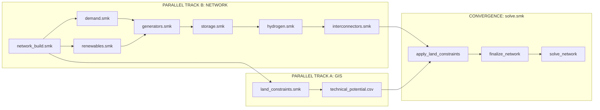

# Unified Land Use Restrictions Workflow for PyPSA-GB

**Version**: 3.0
**Created**: 2026-02-07
**Updated**: 2026-03-29
**Status**: Design / Partial Implementation

> **2026-03-22 Refactor Note — Section A Foundation Layers Updated**:
> The UK LCM 2024 land cover raster (`land_cover_gb.tif`, `build_land_cover_raster`)
> was added to replace urban/suburban buffer logic previously handled via
> population density thresholds. Land cover codes drive technology exclusions
> (`land_cover.exclusion_codes`) and per-code buffer distances in `defaults.yaml`.
>
> **2026-03-28 Reinstatement**: `green_belt_gb.tif`, `alc_bmv_gb.tif`, and
> `population_density_gb.tif` were **reinstated** as separate foundation rasters.
> Green Belt and ALC BMV are config-driven exclusion layers (enabled per technology
> in `defaults.yaml`). Population density is consumed by
> `build_nuclear_pop_criterion` (ONR demographic siting criterion).
> All three scripts, rules, and tests are active in the DAG.
>
> **2026-03-29 Architecture Refactor — Unified Availability Pipeline**:
> All onshore generation technologies now follow a standardised three-step pipeline:
> (1) `build_{tech}_exclusions` → exclusion raster + per-zone availability CSV,
> (2) `build_availability_matrix` → single unified CSV (all techs, all zones),
> (3) `calculate_technical_potential` → p_nom_max per zone per tech.
>
> **Key changes**:
> - Nuclear SMR and hydrogen no longer use zone-level boolean eligibility.
>   Instead, they use pixel-level raster exclusion (same as renewables) to
>   produce accurate per-zone availability fractions that account for
>   overlapping exclusion layers.
> - `build_nuclear_eligibility` replaced by `build_nuclear_smr_exclusions`
>   (outputs exclusion raster + availability CSV). **Implemented & validated.**
> - `build_hydrogen_exclusions` follows the same pattern (future).
> - `calculate_renewable_potential` renamed to `calculate_technical_potential`
>   and extended to read unified availability matrix. **Implemented.**
> - `calculate_zone_statistics` **removed** — each per-technology exclusion
>   rule now includes `area_km2` in its availability CSV, making zone_stats
>   redundant. Per-technology availability CSVs are self-contained.
> - Each availability CSV now includes `area_km2` so `calculate_technical_potential`
>   no longer depends on `zone_statistics`. The availability matrix carries
>   `area_km2` through to technical potential calculation.

---
# Basis of Land Use Restrictions Workflow Plan

**Target final goal:** pypsa-gb model endogenously spatially distributes future new capacity for onshore wind, offshore wind, solar farms, nuclear - small, hydrogen electrolysers, H2 turbines
**Land constraints purpose:** to determine the technical potential (MW/km2) for each generator in each network zone that a generator can be sited
**Scenarios:** applicable only to future scenarios, ignore historical scenarios
**Network Model:** zonal network essential, other network models "nice to have"
**Simplifying assumptions:**
- annual capacity for onshore wind, offshore wind, solar farms = FES annual capacity; the model optimises the zones in which future assets are built but is forced to install the total annual capacity set by FES for each renewable carrier
- marine renewables, hydro renewables thermal renewables modelling remains unchanged
- annual FES capacities for CCGT, OCGT, biomass, oil and to be added CCGT CCS, biomass CCS, and  nuclear - large are not enforced, capacities installed & generation dispatched is endogenously determined to minimise total system costs
- CCGT, OCGT, biomass, oil, nuclear - large are restricted to historical site locations and to be added CCGT CCS, biomass CCS are restricted to industrial clusters locations also to be added
- annual capacity of nuclear - small is optimised endogenously to minimise total system costs and the model optimises the zones in which future assets are built
- annual capacity of hydrogen electrolysers is optimised endogenously to meet hydrogen demand, to be added, and power generation by H2 turbines (Hydrogen-to-Power Generation) and the model optimises the zones in which future assets are  built to minimise total system costs
- network upgrades are applied to the zonal networks, interconnector modelling remains unchanged
- carbon budget constraints (CO₂e limits per modelled year) enforce decarbonisation trajectory aligned with UK's 7th Carbon Budget, applied as `GlobalConstraint` with `type="primary_energy"` and `carrier_attribute="co2_emissions"`

---
## 1. Design Philosophy

The three technology families requiring land constraints (renewables, nuclear, hydrogen) share significant geospatial data infrastructure. Rather than three independent pipelines that duplicate processing, this design uses a **shared foundation → technology branch** architecture within a single `land_constraints.smk` file, with constraint application deferred to `solve.smk`.

The core insight: protected areas, population density, land cover, flooding, and zone shapes are needed by *all three* technology families. Processing them independently wastes computation, introduces inconsistency risk, and creates maintenance burden. Instead, we build shared "foundation layers" once, then branch into technology-specific exclusion rules — all within a single rule file.

A second architectural insight: the entire GIS pipeline depends only on zone shapes from `network_build.smk` — it has **zero dependency** on demand, generators, or storage. This means `land_constraints.smk` runs in **parallel** with `demand.smk`, `renewables.smk`, and the rest of the network integration pipeline, maximising DAG parallelism.

A third insight (added 2026-03-29): per-zone fractions from independently computed raster layers overlap spatially. Naively combining them via thresholds cannot determine the true eligible area. Therefore **all technologies use the same pixel-level raster exclusion approach** — each technology's exclusion rule combines all relevant layers at the pixel level, then calculates the true per-zone availability fraction. This eliminates the overlap problem and produces a single standardised output format across all technologies.

### Architecture Overview

```
land_constraints.smk (all GIS processing):
  Section A: SHARED FOUNDATION      — raw data → standardised rasters & zone statistics
  Section B: PER-TECHNOLOGY EXCLUSIONS — foundation + tech-specific data → exclusion raster + availability CSV
  Section C: UNIFIED AGGREGATION     — merge per-tech CSVs → availability matrix → technical potential

generators.smk (UPDATED — extendable future generators):
  Stage 1: Renewable generators (extendable for future scenarios)
  Stage 2: Thermal generators (SMR extendable, others site-restricted)
  Stage 3: Finalize (unchanged)

hydrogen.smk (UPDATED — H₂ demand + extendable components):
  Build H₂ network, demand, pipelines, storage
  Add extendable electrolysers & H₂ turbines

solve.smk (UPDATED — apply constraints before solving):
  apply_land_constraints → finalize_network → solve_network
```

### DAG Parallelism

```
                         ┌─ demand.smk ───────────┐
                         │                        │
network_build.smk ───────┼─ renewables.smk ───────┼──→ generators.smk → storage → hydrogen → interconnectors
                         │                        │                                              │
                         └─ land_constraints.smk ─┘                                              ↓
                           (runs in parallel       )                               apply_land_constraints
                           (with demand & renewables)                                             │
                                                                                         finalize_network
                                                                                                 │
                                                                                          solve_network
```

The availability matrix (the GIS bottleneck, ~10-20 min) runs concurrently with demand integration rather than blocking behind it.

---

## 2. Data Source Audit

### Shared Across All Technologies

These datasets serve renewables, nuclear, AND hydrogen. Process once.

| Dataset | Technologies | Raw Format | Processed Output |
|---------|-------------|------------|-----------------|
| SAC/SPA/Ramsar/SSSI (excl. marine) | all | gpkg | raster band 1 + zone fractions |
| AONB / NSA / National Parks | onwind, solar, nuclear, H₂ | gpkg/shp | raster band 2 + zone fractions |
| Irreplaceable Habitats (ancient woodland, blanket bog, limestone pavement, coastal sand dunes, lowland fens) | all | gpkg | raster band 3 + zone fractions |
| Historic Environment (WHS, scheduled monuments, RPG, battlefields) | nuclear | gpkg/shp | raster band 4 + zone fractions |
| UK Land Cover Map 2024 | onwind, solar, nuclear, H₂ | GeoTIFF | reclassified raster |
| Flooding Risk (EA, SEPA) | onwind, solar, nuclear, H₂ | gpkg/geojson | raster mask + zone fractions |
| Groundwater SPZ (England, Wales) | onwind, solar, nuclear, H₂ | gpkg | raster mask |
| Zone Shapes (ESO regions) | all | geojson | used directly |

### Technology-Specific Datasets

| Dataset                             | Technology Only | Raw Format   | Processing                               |
| ----------------------------------- | --------------- | ------------ | ---------------------------------------- |
| Crown Estate offshore regions (E&W) | offwind         | geojson      | clip to EEZ                              |
| Sectoral Marine Plan (Scotland)     | offwind         | shp          | merge with Crown Estate                  |
| GEBCO Bathymetry                    | offwind         | netCDF       | depth threshold masks                    |
| Marine Protected Areas (Scotland)   | offwind         | gpkg         | merge with protected areas               |
| EN-6 Designated Sites               | nuclear (large) | csv (manual) | point → zone lookup                      |
| Water Availability / Cooling        | nuclear, H₂     | csv/geojson  | zone classification                      |
| Airfields (classified: MoD, International, Regional, Small) | all technologies, onwind, nuclear | gpkg → 4-band tif | hard exclusion + buffers (6-15km wind OLS, 30km nuclear) |
| Seismic Hazards / Fracking          | nuclear, H₂     | gpkg         | buffer zones (30km nuclear)              |
| Deep Geothermal Areas               | nuclear, H₂     | gpkg         | buffer zones                             |
| Reservoirs & Dams                   | nuclear         | csv          | buffer zones (30km)                      |
| Critical Infrastructure (gas)       | nuclear         | shp          | buffer zones (12km)                      |
| Protected Groundwater (SPZ)         | nuclear, H₂     | gpkg         | exclusion mask                           |
| Scotland boundary                   | nuclear         | geojson      | political exclusion                      |

### Key Observations

1. **Protected areas** are the single most reused dataset — needed by every technology. Each technology enables/disables tiers as hard exclusions (no buffer distances). The foundation layer produces a 4-band raster; tier selection happens in the technology config.

2. **Population density** serves different purposes: onshore wind uses it for distance buffers from urban areas, nuclear uses it for 3km emergency planning zones, hydrogen uses similar buffers. The foundation builds the density surface; thresholds are technology-specific.

3. **Offshore** is almost entirely independent — bathymetry, marine areas don't overlap with onshore constraints. The only shared element is zone shapes for aggregation.

4. **Nuclear and hydrogen** share the most overlap beyond the universal datasets: both need seismic, groundwater protection, water availability, and population buffers.

---

## 3. Snakemake Rule Architecture

All GIS processing lives in a single `land_constraints.smk` file with three clearly delineated sections. Generator/hydrogen integration scripts are updated to add extendable components. Constraint application happens in `solve.smk` as a pre-optimisation step.

### `rules/land_constraints.smk` (NEW)
#tocode  NB: add to documentation - - `--rerun-triggers mtime` — only rebuild if input files are actually newer (avoids rebuilding when only code changes)

Single file (~300 lines), three sections. No PyPSA network objects — outputs are rasters and CSVs only.

```
rules/land_constraints.smk
│
├── SECTION A: SHARED FOUNDATION (runs once, all technologies consume)
│   ├── build_protected_areas_raster      → resources/land/protected_areas_gb.tif (4-band)
│   ├── build_land_cover_raster           → resources/land/land_cover_gb.tif
│   ├── build_population_density_surface  → resources/land/population_density_gb.tif
│   ├── build_flooding_risk_raster        → resources/land/flooding_risk_gb.tif
│   ├── build_groundwater_protection      → resources/land/groundwater_spz_ew.tif
│   ├── build_green_belt_raster           → resources/land/green_belt_gb.tif
│   ├── build_alc_raster                  → resources/land/alc_bmv_gb.tif
│   ├── build_airfield_raster             → resources/land/airfields_gb.tif (2-band)
│   ├── build_coastal_erosion_raster      → resources/land/coastal_erosion_gb.tif
│   └── build_scotland_mask               → resources/land/scotland_mask_{network_model}.tif + scotland_zones CSV
│
├── SECTION B: PER-TECHNOLOGY EXCLUSION RULES (each outputs raster + CSV)
│   │
│   │ Onshore renewables:
│   ├── build_onshore_renewable_exclusions  → raster + CSV (onwind, solar)     [IMPLEMENTED 2026-03-29, refactored from build_onshore_renewable_availability]
│   │
│   │ Offshore (anomaly — geometry-based, not raster exclusion):
│   ├── build_offshore_exclusions           → resources/land/offshore_exclusions.tif
│   ├── build_offshore_available_kra        → resources/land/offshore_available_kra_{network_model}.gpkg
│   │
│   │ Nuclear SMR:
│   ├── build_nuclear_pop_criterion         → resources/land/nuclear_pop_criterion_{nm}.tif + fractions CSV
│   ├── build_nuclear_exclusion_zones       → resources/land/nuclear_exclusion_zones_{nm}.csv (diagnostic)
│   ├── build_nuclear_smr_exclusions        → raster + CSV (smr)               [IMPLEMENTED 2026-03-29]
│   │
│   │ Hydrogen:
│   └── build_hydrogen_exclusions           → raster + CSV (electrolysis, h2)  [FUTURE]
│
└── SECTION C: UNIFIED AGGREGATION
    ├── build_availability_matrix           → resources/land/availability_matrix_{network_model}.csv  [IMPLEMENTED 2026-03-29]
    └── calculate_technical_potential       → resources/land/technical_potential_{network_model}.csv   [IMPLEMENTED 2026-03-29]
```

**Three-step pipeline (all onshore technologies):**
```
Step 1: build_{tech}_exclusions      → exclusion raster (.tif) + per-zone availability CSV
Step 2: build_availability_matrix    → single unified CSV (merge all per-tech CSVs)
Step 3: calculate_technical_potential → p_nom_max per zone per tech
```

Each Step 1 rule:
- Loads shared foundation rasters (protected areas, airfields, land cover, flooding, SPZ, coastal erosion, ALC BMV, Green Belt)
- Applies technology-specific config (which layers enabled, buffer distances, thresholds)
- Adds technology-specific layers (e.g. Scotland ban + ONR pop criterion + COMAH + gas pipe for SMR)
- Outputs BOTH an exclusion raster (for validation/QGIS/thesis maps) AND a per-zone availability CSV
- Offshore wind is an anomaly: KRA/bathymetry-based geometry processing, not raster exclusion

### `rules/generators.smk` (UPDATED)

The existing 3-stage pipeline structure is preserved. Changes are within the integration scripts:

```
rules/generators.smk (existing structure, script updates)
│
├── Stage 1: integrate_renewable_generators
│   └── UPDATE: For future scenarios, add onshore wind, offshore wind, solar
│       as extendable generators (p_nom=0, p_nom_extendable=True).
│       Marine and hydro renewables remain unchanged.
│
├── Stage 2: integrate_thermal_generators
│   └── UPDATE: Add SMR as extendable generators at all zones
│       (p_nom=0, p_nom_extendable=True).
│       CCGT, OCGT, biomass, oil, nuclear-large: restricted to historical sites.
│       Future: CCGT CCS, biomass CCS restricted to industrial cluster locations.
│
└── Stage 3: finalize_generator_integration (unchanged)
```

### `rules/hydrogen.smk` (UPDATED)

The existing zonal H₂ network (38 buses, 40 pipeline links, 5 storage sites) is preserved. Updates:

```
rules/hydrogen.smk (existing structure, script updates)
│
├── Build hydrogen network          (existing — buses from data/hydrogen/buses.csv)
├── Add hydrogen pipeline links     (existing — links from data/hydrogen/links.csv)
├── Add hydrogen storage            (existing — stores from data/hydrogen/store.csv)
├── Add hydrogen demand             (NEW — industrial/heating H₂ demand at H₂ buses)
├── Add electrolysers               (UPDATE — extendable, p_nom_max set later)
└── Add H₂ turbines                 (UPDATE — extendable, p_nom_max set later)
```

### `rules/solve.smk` (UPDATED)

A new `apply_land_constraints` rule is inserted before `finalize_network`:

```
rules/solve.smk
│
├── apply_land_constraints (NEW)
│   ├── Input: network + conditional land constraint CSVs
│   ├── Set p_nom_max on renewable generators from technical potential
│   ├── Set p_nom_max on SMR generators from nuclear eligibility
│   ├── Set p_nom_max on electrolysers/H₂ turbines from H₂ eligibility
│   ├── Store FES annual capacity targets as metadata (enforced via extra_functionality at solve time)
│   ├── Add carbon budget constraint (CO₂e limit from config, per modelled year)
│   └── Output: constrained network
│
├── finalize_network (UPDATED input — reads constrained network if enabled)
│
└── solve_network (unchanged)
```

### Why this structure

| Design decision | Choice | Rationale |
|----------------|--------|-----------|
| How many land constraint files? | 1 (`land_constraints.smk`) | 16 rules fit in ~300 lines; clear section headers are sufficient. Avoids 5-file fragmentation. |
| Where does GIS processing live? | `land_constraints.smk` only | DAG parallelism with demand pipeline. Single responsibility. Independent testability. |
| Where are constraints applied? | `solve.smk` (`apply_land_constraints`) | Post-integration, pre-solve. Cleanly optional via config toggle. |
| How are future generators modelled? | Extendable (`p_nom=0`, `p_nom_extendable=True`) | p_nom_max deferred to constraint application. Model works with or without land constraints. |
| Where do FES annual capacity constraints go? | `apply_land_constraints` stores targets; `solve_network` enforces via `extra_functionality` | Capacity constraints (sum p_nom == target MW) require linopy variables, only available at solve time. `GlobalConstraint` with `type="primary_energy"` constrains energy (MWh), not capacity (MW). |
| Where do carbon budget constraints go? | `solve.smk` (`apply_land_constraints`) | Same — optimisation constraint, not component property. CO₂e budget per period from config. |

---

## 4. Detailed Rule Specifications

### 4.1 Section A: Shared Foundation (`rules/land_constraints.smk`)

#### Helper functions (as implemented)

```python
# Access defaults.yaml values (merged into _full_config by load_config)
_defaults = _full_config["defaults"]

def get_zones_for_model(wildcards):
    """Get the zone shapes file for a given network_model.

    Currently only the Zonal network model is supported for land constraints.
    ETYS and Reduced network models do not use zone-based land constraints.
    """
    model = wildcards.network_model
    if model != "Zonal":
        raise ValueError(
            f"Land constraints are only supported for the Zonal network model, "
            f"got '{model}'."
        )
    return f"{data_path}/network/zonal/zones.geojson"
```

**Config access**: All rule params use `_defaults.get(...)` (which points to `_full_config["defaults"]`) rather than `config.get(...)`, because the Snakemake `config` object only contains `config.yaml` — land constraint settings live in `defaults.yaml`.

#### `build_protected_areas_raster`

Merges all protected area designations into a single multi-band raster. Each band represents a designation tier, enabling technology branches to apply different buffers to different designation types.

```python
rule build_protected_areas_raster:
    """
    Merge all GB protected/environmental designation datasets into a
    standardised 4-band raster.

    Band 1: SAC + SPA + Ramsar + SSSI (excluding marine areas)
    Band 2: AONB + National Scenic Areas + National Parks
    Band 3: Irreplaceable habitats (ancient woodland, blanket bog,
            limestone pavement, coastal sand dunes, lowland fens)
    Band 4: Historic environment (WHS, scheduled monuments,
            registered parks & gardens, battlefields)

    Each technology enables/disables tiers via config (hard exclusion).
    """
    input:
        # Tier 1: SAC/SPA/Ramsar/SSSI (excluding marine)
        sac="data/land/environment/gb_sac_excluding_marine.gpkg",
        spa="data/land/environment/gb_spa_excluding_marine.gpkg",
        ramsar="data/land/environment/gb_ramsar_excluding_marine.gpkg",
        sssi_eng="data/land/environment/sssi_england_excluding_marine.gpkg",
        sssi_sco="data/land/environment/sssi_scotland_excluding_marine.gpkg",
        sssi_wal="data/land/environment/sssi_wales_excluding_marine.gpkg",
        # Tier 2: AONB/NatParks/NSA
        aonb_eng="data/land/environment/aonb_england.gpkg",
        aonb_wal="data/land/environment/aonb_wales.gpkg",
        nsa_sco="data/land/environment/nsa_scotland.shp",
        natpark_eng="data/land/environment/national_parks_england.gpkg",
        natpark_wal="data/land/environment/national_parks_wales.gpkg",
        natpark_sco="data/land/environment/national_parks_scotland.gpkg",
        # Tier 3: Irreplaceable habitats
        aw_eng="data/land/environment/ancient_woodland_england.gpkg",
        aw_sco="data/land/environment/ancient_woodland_scotland.gpkg",
        aw_wal="data/land/environment/ancient_woodland_wales.gpkg",
        irr_eng="data/land/environment/irreplaceable_habitats_england.gpkg",
        irr_sco="data/land/environment/irreplaceable_habitats_scotland.gpkg",
        irr_bog_wal="data/land/environment/irreplaceable_habitats_blanket_bog_wales.gpkg",
        irr_dunes_wal="data/land/environment/coastal_sand_dunes_wales.gpkg",
        irr_lime_wal="data/land/environment/irreplaceable_habitats_limestone_pavement_wales.gpkg",
        irr_fens_wal="data/land/environment/irreplaceable_habitats_lowland_fens_wales.gpkg",
        # Tier 4: Historic environment
        hist_eng="data/land/environment/historic_environment_england.gpkg",
        hist_sco="data/land/environment/historic_environment_scotland.gpkg",
        hist_wal="data/land/environment/historic_environment_wales.gpkg",
    output:
        raster="resources/land/protected_areas_gb.tif",
        zone_fractions="resources/land/protected_area_fractions.csv",
    params:
        resolution=100,  # metres
        target_crs=27700,  # OSGB36 / British National Grid
    log: "logs/land/build_protected_areas_raster.log"
    benchmark: "benchmarks/land/build_protected_areas_raster.txt"
    resources: mem_mb=8000
    script: "../scripts/land/build_protected_areas_raster.py"
```

**Processing logic:**
1. Read all 24 vector sources, reproject to EPSG:27700
2. Merge by tier: Tier 1 (SAC+SPA+Ramsar+SSSI excl. marine), Tier 2 (AONB+NSA+NatParks), Tier 3 (Irreplaceable Habitats), Tier 4 (Historic Environment)
3. Dissolve overlapping geometries within each tier
4. Rasterize each tier as a separate band at 100m resolution
5. Calculate zone-level fractions (% of each zone covered by each tier)
6. Output: 4-band GeoTIFF + CSV of zone fractions

**Marine exclusion note:** Tier 1 uses `_excluding_marine.gpkg` versions of SAC/SPA/Ramsar/SSSI files, clipped to the GB land boundary (derived from land cover raster). This prevents marine designations inflating zone statistics for coastal zones — in the original data, 72% of SAC/SPA pixels were over sea.

#### `build_land_cover_raster`

```python
rule build_land_cover_raster:
    """
    Reproject and resample UK Land Cover Map 2024 to the canonical GB
    reference grid. Masks to Great Britain using dissolved GSP regions
    (removing Northern Ireland). Retains original 21 habitat class codes
    for technology-specific filtering downstream.

    Transforms: 25m UK-wide LCM raster → 100m GB-only land cover GeoTIFF
    """
    input:
        lcm="data/land/societal/uk_lcm_2024.tif",
        gb_boundary="data/network/GSP/GSP_regions_20250109/GSP_regions_20250109.shp",
    output:
        raster="resources/land/land_cover_gb.tif",
    params:
        resolution=lambda wc: _defaults.get('land_constraints', {}).get('foundation', {}).get('resolution', 100),
        target_crs=lambda wc: _defaults.get('land_constraints', {}).get('foundation', {}).get('target_crs', 27700),
    message:
        "Reprojecting UK LCM 2024 to canonical GB reference grid (100m, 21 habitat classes)"
    log:
        "logs/land/build_land_cover_raster.log"
    benchmark:
        "benchmarks/land/build_land_cover_raster.txt"
    conda:
        "../envs/pypsa-gb.yaml"
    resources:
        mem_mb=6000
    script:
        "../scripts/land/build_land_cover_raster.py"
```

#### `build_population_density_surface`

```python
rule build_population_density_surface:
    """
    Create population density raster from Census 2021 Output Areas.

    Produces a continuous density surface (people/km²) at 100m resolution.
    Technology branches apply their own thresholds and buffer distances.

    Scotland GPKG has population counts embedded (Popcount, HHcount, sqkm).
    England & Wales GPKG contains boundaries only — population density
    (people/km²) is joined from a separate Census 2021 TS006 CSV at OA
    level (188,880 rows) via OA21CD code.

    Consumed by build_nuclear_pop_criterion (ONR demographic siting
    criterion). No separate zone CSV is needed here.
    """
    input:
        oa_shapes_ew="data/land/societal/output_areas_ew.gpkg",
        oa_density_ew="data/land/societal/output_areas_ew.csv",
        oa_shapes_sco="data/land/societal/output_areas_scotland.gpkg",
    output:
        raster="resources/land/population_density_gb.tif",
    params:
        resolution=100,
        target_crs=27700,
    log: "logs/land/build_population_density_surface.log"
    benchmark: "benchmarks/land/build_population_density_surface.txt"
    resources: mem_mb=8000
    script: "../scripts/land/build_population_density_surface.py"
```

#### `build_flooding_risk_raster`

```python
rule build_flooding_risk_raster:
    """
    Merge EA (England), NRW (Wales), and SEPA (Scotland) flooding data
    into unified risk raster. Includes river, surface water, and coastal
    flood maps from all three nations. Uses chunked fiona streaming to
    keep memory bounded (~500 MB peak instead of ~20 GB).
    """
    input:
        flood_eng="data/land/hazards/flood_zones_cc_england.gpkg",
        flood_sco_river="data/land/hazards/flood_zones_rivers_scotland.gpkg",
        flood_sco_surface="data/land/hazards/flood_zones_surface_scotland.gpkg",
        flood_sco_coastal="data/land/hazards/flood_zones_coastal_scotland.gpkg",
        flood_wal="data/land/hazards/flood_zones_seas_rivers_wales.gpkg",
        flood_wal_surface="data/land/hazards/flood_zones_surface_wales.gpkg",
    output:
        raster="resources/land/flooding_risk_gb.tif",
    params:
        resolution=lambda wc: _defaults.get('land_constraints', {}).get('foundation', {}).get('resolution', 100),
        target_crs=lambda wc: _defaults.get('land_constraints', {}).get('foundation', {}).get('target_crs', 27700),
    message:
        "Building GB unified flooding risk raster"
    log:
        "logs/land/build_flooding_risk_raster.log"
    benchmark:
        "benchmarks/land/build_flooding_risk_raster.txt"
    conda:
        "../envs/pypsa-gb.yaml"
    resources:
        mem_mb=6000
    script:
        "../scripts/land/build_flooding_risk_raster.py"
```

#### `build_groundwater_protection`

```python
rule build_groundwater_protection:
    """
    Rasterize Source Protection Zones for England and Wales as a 3-band
    GeoTIFF (Band 1 = SPZ1, Band 2 = SPZ2, Band 3 = SPZ3). Scotland does
    not implement similar protection areas around drinking water sources
    and is excluded.

    Downstream consumers (per-technology exclusion rules) select bands
    via the per-technology exclusion_zones config parameter.
    """
    input:
        spz_eng="data/land/environment/source_protection_zones_england.gpkg",
        spz_wal="data/land/environment/source_protection_zones_wales.gpkg",
    output:
        raster="resources/land/groundwater_spz_ew.tif",
    params:
        resolution=lambda wc: _defaults.get('land_constraints', {}).get('foundation', {}).get('resolution', 100),
        target_crs=lambda wc: _defaults.get('land_constraints', {}).get('foundation', {}).get('target_crs', 27700),
    message:
        "Building England & Wales 3-band groundwater protection raster"
    log:
        "logs/land/build_groundwater_protection.log"
    benchmark:
        "benchmarks/land/build_groundwater_protection.txt"
    conda:
        "../envs/pypsa-gb.yaml"
    resources:
        mem_mb=4000
    script:
        "../scripts/land/build_groundwater_protection.py"
```

#### `build_coastal_erosion_raster`

```python
rule build_coastal_erosion_raster:
    """
    Build single-band coastal erosion exclusion raster from NCERM 2024 data.

    Loads 3 layers from the NCERM GeoPackage, rasterizes, and OR-merges:
    - NCERM_SMP_2105_70CC: SMP-delivered erosion at 2105 (70th %ile CC
      from UKCP18 RCP8.5). The 2105 horizon reflects long asset life of
      energy infrastructure, particularly nuclear (~60 years).
    - NCERM_Ground_Instability_Zone: historical ground instability areas
    - NCERM_Ground_Instability_Recession: predicted ground instability recession

    Transforms: NCERM 2024 GPKG (3 layers) → single-band binary GeoTIFF
    """
    input:
        coastal_erosion="data/land/hazards/coastal_erosion_uk_2024.gpkg",
    output:
        raster="resources/land/coastal_erosion_gb.tif",
    params:
        layers=lambda wc: _defaults.get('land_constraints', {}).get('coastal_change', {}).get('layers', [...]),
        resolution=lambda wc: _defaults.get('land_constraints', {}).get('foundation', {}).get('resolution', 100),
        target_crs=lambda wc: _defaults.get('land_constraints', {}).get('foundation', {}).get('target_crs', 27700),
    log: "logs/land/build_coastal_erosion_raster.log"
    benchmark: "benchmarks/land/build_coastal_erosion_raster.txt"
    resources: mem_mb=2000
    conda: "../envs/pypsa-gb.yaml"
    script: "../scripts/land/build_coastal_erosion_raster.py"
```

**Processing logic:**
1. Read 3 named layers from the multi-layer NCERM 2024 GeoPackage (already EPSG:27700)
2. For each layer: load via geopandas, rasterize to canonical GB reference grid at 100m
3. OR-merge all layers into single accumulator array (`np.maximum`)
4. Output: single-band binary GeoTIFF (1 = erosion/instability risk, 0 = safe)

**Data source**: National Coastal Erosion Risk Mapping (NCERM) - National (2024), Environment Agency. ~22k features across 3 layers. MultiPolygon Z geometries. No reprojection needed (source is EPSG:27700).

**EN-7 rationale**: EN-7 (Nuclear NPS) requires consideration of coastal change for energy infrastructure siting. The 2105 time horizon (70th percentile climate change) was chosen to reflect the ~60-year operational lifetime of nuclear assets plus decommissioning.

#### ~~`calculate_zone_statistics`~~ — REMOVED (2026-03-29)

This rule was removed because each per-technology exclusion rule now does pixel-level intersection and includes `area_km2` in its availability CSV. The per-layer fraction breakdown it provided is no longer needed for the pipeline — the per-technology availability fractions (which correctly account for overlapping layers) replaced it. The script and test files are retained in the codebase for potential future diagnostic use but are not part of the active DAG.

#### `build_scotland_mask`

```python
rule build_scotland_mask:
    """
    Create binary raster mask for Scotland (nuclear exclusion).
    Simple but critical — nuclear is banned from Scotland.

    Uses {network_model} wildcard — zone shapes depend only on network_model.
    """
    input:
        zones=get_zones_for_model,
    output:
        mask="resources/land/scotland_mask_{network_model}.tif",
        scotland_zones="resources/land/scotland_zones_{network_model}.csv",
    params:
        # Scottish ESO zones — defined in defaults.yaml, accessed via _defaults
        scottish_zones=lambda wc: _defaults.get('scotland', {}).get('zones', []),
    wildcard_constraints:
        network_model="[^/]+"
    log: "logs/land/build_scotland_mask_{network_model}.log"
    benchmark: "benchmarks/land/build_scotland_mask_{network_model}.txt"
    resources: mem_mb=4000
    conda: "../envs/pypsa-gb.yaml"
    script: "../scripts/land/build_scotland_mask.py"
```

**Scotland zones** (from `config/defaults.yaml`): `["Z1_1", "Z1_2", "Z1_3", "Z1_4", "Z2", "Z3", "Z4", "Z5", "Z6"]` — covers all 9 Scottish zones in the zonal network.

#### `build_green_belt_raster`

```python
rule build_green_belt_raster:
    """
    Rasterize Green Belt boundaries (England and Scotland) into a
    binary mask. Wales does not have statutory Green Belt.

    Green Belt is a soft constraint for solar and nuclear SMR siting.
    Applied as increased siting difficulty rather than absolute
    prohibition.

    Transforms: 2 Green Belt GeoPackages → single-band binary GeoTIFF
    """
    input:
        gb_eng="data/land/societal/green_belt_england.gpkg",
        gb_sco="data/land/societal/green_belt_scotland.gpkg",
    output:
        raster="resources/land/green_belt_gb.tif",
    params:
        resolution=lambda wc: _defaults.get('land_constraints', {}).get('foundation', {}).get('resolution', 100),
        target_crs=lambda wc: _defaults.get('land_constraints', {}).get('foundation', {}).get('target_crs', 27700),
    message:
        "Building Green Belt raster from England and Scotland boundaries"
    log:
        "logs/land/build_green_belt_raster.log"
    benchmark:
        "benchmarks/land/build_green_belt_raster.txt"
    conda:
        "../envs/pypsa-gb.yaml"
    resources:
        mem_mb=4000
    script:
        "../scripts/land/build_green_belt_raster.py"
```

**Processing logic:**
1. Load England and Scotland Green Belt boundaries, reproject to EPSG:27700
2. Merge into single GB layer (Wales has no statutory Green Belt)
3. Dissolve overlapping geometries
4. Rasterize to binary mask at 100m resolution
5. Output: single-band GeoTIFF (1 = Green Belt, 0 = not Green Belt)

#### `build_alc_raster`

```python
rule build_alc_raster:
    """
    Load pre-filtered BMV agricultural land GeoPackages for England,
    Wales, and Scotland and rasterize into a unified binary mask.

    Input files contain only BMV features (Grades 1, 2, 3a for
    England/Wales; LCA classes 1, 2, 3.1 for Scotland). Used as
    hard constraint for solar and nuclear SMR siting — planning
    policy preference for lower-grade agricultural land.

    Transforms: 3 BMV GeoPackages → single-band binary GeoTIFF
    """
    input:
        alc_eng="data/land/societal/alc_bmv_england.gpkg",
        alc_wal="data/land/societal/alc_bmv_wales.gpkg",
        alc_sco="data/land/societal/alc_bmv_scotland.gpkg",
    output:
        raster="resources/land/alc_bmv_gb.tif",
    params:
        resolution=lambda wc: _defaults.get('land_constraints', {}).get('foundation', {}).get('resolution', 100),
        target_crs=lambda wc: _defaults.get('land_constraints', {}).get('foundation', {}).get('target_crs', 27700),
    message:
        "Building BMV agricultural land raster from pre-filtered GeoPackages"
    log:
        "logs/land/build_alc_raster.log"
    benchmark:
        "benchmarks/land/build_alc_raster.txt"
    conda:
        "../envs/pypsa-gb.yaml"
    resources:
        mem_mb=4000
    script:
        "../scripts/land/build_alc_raster.py"
```

**Processing logic:**
1. Load ALC data from three nations, reproject to EPSG:27700
2. Classify BMV land: England Grades 1, 2, 3a (and 3 undifferentiated as BMV, conservative); Wales Grades 1, 2, 3a; Scotland Prime land
3. Merge into single GB layer
4. Rasterize to binary mask at 100m resolution (1 = BMV, 0 = not BMV)
5. Output: single-band GeoTIFF

---

#### `build_airfield_raster` - DONE, VALIDATED

Builds a 2-band FRZ (Flight Restriction Zone) exclusion raster from authoritative UK AIP ENR 5.1 data. Reads pre-extracted civil and military aerodrome FRZ CSVs containing centre coordinates (WGS84) and FRZ circle radii (km). Buffers each centre point by its FRZ radius and rasterizes to a 2-band GeoTIFF.

The FRZ radius **is** the exclusion zone — no downstream `airport_buffer` config or additional buffering is needed. All onshore technologies (onwind, solar, nuclear SMR) apply this raster as a hard exclusion mask.

**Data provenance:** FRZ data extracted from `data/land/hazards/raw/airfields_protected_military.xlsx` (UK AIP ENR 5.1, sheet "restricted") by `scripts/land/extract_aerodrome_frz.py`. Only EGRnU 'A' suffix entries (primary ATZ circles) are retained. MoD/civil classification uses a keyword dictionary matching aerodrome names against known military installations (RAF, RNAS, AAC, USAF, QinetiQ bases).

```python
rule build_airfield_raster:
    """
    Build 2-band FRZ exclusion raster from aerodrome Flight Restriction Zone data.

    Reads civil and military aerodrome FRZ CSVs (extracted from UK AIP ENR 5.1)
    with centre coordinates and FRZ circle radii. Buffers each point by its FRZ
    radius and rasterizes to a 2-band GeoTIFF.

    Output — airfields_gb.tif (2-band GeoTIFF, 100m, EPSG:27700):
        - Band 1: MoD/Military FRZ circles
        - Band 2: Civilian FRZ circles

    No downstream buffering needed — FRZ radius is baked into the raster.
    """
    input:
        civil_frz=f"{data_path}/land/hazards/civil_aerodromes_frz.csv",
        mod_frz=f"{data_path}/land/hazards/mod_aerodromes_frz.csv",
    output:
        raster=f"{resources_path}/land/airfields_gb.tif",
    params:
        resolution=lambda wc: _defaults.get('land_constraints', {}).get('foundation', {}).get('resolution', 100),
        target_crs=lambda wc: _defaults.get('land_constraints', {}).get('foundation', {}).get('target_crs', 27700),
    message:
        "Building FRZ exclusion raster from aerodrome data"
    log: "logs/land/build_airfield_raster.log"
    benchmark: "benchmarks/land/build_airfield_raster.txt"
    conda: "../envs/pypsa-gb.yaml"
    resources: mem_mb=4000
    script: "../scripts/land/build_airfield_raster.py"
```

**Processing logic:**
1. Load civil and MoD FRZ CSVs (`encoding='latin-1'`, `usecols` to ignore trailing Excel columns)
2. Create Point geometries from `lon_dd`, `lat_dd` (EPSG:4326), reproject to EPSG:27700
3. Buffer each point by `frz_radius_km * 1000` metres to create exclusion polygons
4. Rasterize MoD circles → Band 1, civilian circles → Band 2
5. Write 2-band GeoTIFF (uint8, LZW compression) at 100m resolution in EPSG:27700

**FRZ data summary:**
- 116 civil aerodromes + 42 MoD aerodromes = 158 total
- FRZ radii: 2.0–4.63 km (typical: 3.704 km = 2 NM, 4.63 km = 2.5 NM)
- All entries are circles (partial-arc entries resolved to circles with embedded radius)

---

---

### 4.2 Section B: Renewable Constraints (`rules/land_constraints.smk`)

Section B rules build the renewable availability layers and compute technical potential.
No `{scenario}` wildcard is needed — these rules produce physical/spatial outputs that
are scenario-independent (the same exclusions and resource areas apply regardless of FES pathway).

**Downstream integration**: `apply_land_constraints` (in `solve.smk`) consumes the
technical potential outputs and subtracts existing/committed capacity (loaded by
`integrate_renewable_generators.py` from REPD + AR1–AR7 leases) to set `p_nom_max`
on extendable generators.

#### `build_offshore_exclusions` - DONE, NOT VALIDATED

**Scope**: This rule ONLY builds a binary exclusion raster for offshore areas.
It does NOT process KRAs, calculate technical potential, or assign technologies.
KRA processing happens downstream in `build_offshore_available_kra`.

**Exclusion types** (8 categories):

1. Marine Protected Areas (MPAs) — UK-wide designations
2. Shipping routes (Q90 density threshold)
3. Oil & gas fields (licensed hydrocarbon areas)
4. CCS licence areas (carbon capture & storage)
5. Gas storage areas
6. Tidal/wave plan option areas
7. Marine mining & aggregates
8. Historic environment (marine) designations

```python
rule build_offshore_exclusions:
    """
    Build binary offshore exclusion raster from marine constraint layers.

    Rasterises all offshore exclusion zones (MPAs, shipping Q90, O&G fields,
    CCS licences, gas storage, tidal/wave plan options, marine mining,
    historic environment) into a single binary raster: 1 = excluded,
    0 = not excluded.

    This rule does NOT handle KRA processing or technology assignment —
    those are handled downstream by build_offshore_available_kra.
    """
    input:
        gb_eez_zones="data/land/marine/gb_eez.gpkg",
        marine_protected_gb="data/land/marine/offwind_protected_areas_gb.gpkg",
        shipping_density='data/land/marine/shipping_density_eu.geotiff',
        ccs_ew='data/land/marine/offshore_licensed_ccs_ew.gpkg',
        ccs_sco='data/land/marine/offshore_licensed_ccs_scotland.gpkg',
        gas_storage_gb='data/land/marine/offshore_gas_storage_sites_gb.gpkg',
        og_areas_gb='data/land/marine/offshore_o&g_zones_gb.gpkg',
        marine_mining_gb='data/land/marine/marine_mining_sites_gb.gpkg',
        marine_aggregates_gb='data/land/marine/marine_aggregates_sites_gb.gpkg',
        historic_environment_marine='data/land/marine/historic_environment_marine.gpkg',
        wave_sco='data/land/marine/wave_licensed_sites_scotland.gpkg',
        wave_ew='data/land/marine/wave_licensed_sites_ew.gpkg',
        tidal_sco='data/land/marine/tidal_licensed_sites_scotland.gpkg',
        tidal_ew='data/land/marine/tidal_licensed_sites_ew.gpkg',
    output:
        exclusion_raster="resources/land/offshore_exclusions.tif",
    params:
        config=lambda wc: _defaults.get('land_constraints', {}),
    message:
        "Building offshore exclusion raster from marine constraint layers"
    log:
        "logs/land/build_offshore_exclusions.log"
    benchmark:
        "benchmarks/land/build_offshore_exclusions.txt"
    resources:
        mem_mb=6000
    conda:
        "../envs/pypsa-gb.yaml"
    script:
        "../scripts/land/build_offshore_exclusions.py"
```

**Processing steps** (in script):

1. Load exclusion zones files (8 exclusion types)
2. Filter datasets to only include data within GB EEZ region
3. Filter shipping density to only include as an exclusion zone routes in the 90th percentile
4. Merge all exclusion geometries into unified GeoDataFrame
5. Reproject to EPSG:27700 (OSGB36) if needed
6. Rasterise to canonical GB grid (matching foundation rasters): 1 = excluded, 0 = available
7. Write single-band GeoTIFF output

**Output**: Single binary raster `resources/land/offshore_exclusions.tif` —
consumed by `build_offshore_available_kra` for both fixed and floating offshore wind.

#### `build_offshore_available_kra` - DONE, VALIDATED

Processes offshore wind Key Resource Areas (KRAs) by subtracting marine
exclusion zones, classifying TG (Technology Group) cost tiers, calculating
distance-to-coast, and intersecting with zone boundaries. Produces a
GeoPackage where each record is one KRA-zone intersection fragment with
full classification attributes preserved for downstream cost modelling.

This rule was separated from `build_onshore_renewable_availability` because:
- KRA data is fundamentally vector (not raster) — a GeoPackage preserves
  TG classification, cost tier, and per-polygon attributes naturally
- Available area is the direct result of exclusion subtraction — computing
  it here makes the output self-contained and independently verifiable
- Downstream rules (capacity expansion model) need KRA-level records with
  TG cost multipliers, not zone-level availability fractions

**Excluded inputs** (handled downstream):
- CES leases (existing capacity) — handled in `apply_land_constraints`
- INTOG application areas — excluded as a data input

```python
rule build_offshore_available_kra:
    """
    Process offshore wind KRAs: subtract exclusions, classify TG/cost tiers,
    calculate distance-to-coast, intersect with zones, compute available area.

    Loads Fixed and Floating KRA polygons, subtracts the offshore exclusion
    raster, parses TG classification from Rating attribute, maps to cost tiers,
    calculates centroid distance to nearest coastline, classifies AC/DC
    connection type, and intersects with zone boundaries.

    Each output record is one KRA-zone intersection fragment with:
    kra_name, tg_class, cost_tier, capex_multiplier, kra_type, carrier,
    connection_type, distance_to_coast_km, zone_name, available_area_km2,
    centroid_x, centroid_y, geometry.
    """
    input:
        fixed_kra=f"{data_path}/land/marine/raw/Fixed_Wind_KRA_(England26_NI)%2C_The_Crown_Estate.geojson",
        floating_kra=f"{data_path}/land/marine/raw/Floating_Wind_KRA_(England26_NI)%2C_The_Crown_Estate.geojson",
        exclusion_raster=f"{resources_path}/land/offshore_exclusions.tif",
        zones=get_zones_for_model,
    output:
        available_kra=f"{resources_path}/land/offshore_available_kra_{{network_model}}.gpkg",
    params:
        config=lambda wc: _defaults.get('land_constraints', {}),
    wildcard_constraints:
        network_model="[^/]+"
    message:
        "Processing offshore KRAs for {wildcards.network_model}: TG classification, exclusion subtraction, zone intersection"
    log:
        "logs/land/build_offshore_available_kra_{network_model}.log"
    benchmark:
        "benchmarks/land/build_offshore_available_kra_{network_model}.txt"
    resources:
        mem_mb=4000
    conda:
        "../envs/pypsa-gb.yaml"
    script:
        "../scripts/land/build_offshore_available_kra.py"
```

**Processing steps** (in script):

1. Load Fixed KRA (13 polygons) and Floating KRA (6 polygons) geojsons, reproject from EPSG:4326 to EPSG:27700
2. Parse `Rating` attribute ("Technology Group 7B") → `tg_class` ("TG-7B") using regex
3. Map TG → cost_tier and capex_multiplier via lookup tables:
   - **Fixed**: F1 (1.00) ← TG-1,2A,2B,4A; F2a (1.10) ← TG-3A,3B,4B; F2b (1.15) ← TG-5A,5B; F3a (1.20) ← TG-6A,6B; F3b (1.30) ← TG-7A,7B
   - **Floating**: FL1 (1.00) ← TG-1; FL2a (1.10) ← TG-2,3; FL2b (1.15) ← TG-4; FL3a (1.20) ← TG-5; FL3b (1.30) ← TG-6
4. Derive coastline from union of onshore zone boundaries (excluding DOGGER_BANK, HORNSEA, EAST_ANGLIA offshore zones)
5. Calculate distance from each KRA centroid to nearest coastline point using `shapely.ops.nearest_points`
6. Classify carrier and connection type:
   - Fixed + distance < 50km → `offwind-fixed-ac` (AC)
   - Fixed + distance ≥ 50km → `offwind-fixed-dc` (DC)
   - Floating + distance < 50km → `offwind-float-ac` (AC)
   - Floating + distance ≥ 50km → `offwind-float-dc` (DC)
7. Intersect KRA polygons with zone boundaries using `gpd.overlay(how="intersection")` — splits KRAs at zone borders, preserving all attributes on each fragment
8. For each KRA-zone fragment, sample the offshore exclusion raster using `rasterio.mask.mask(crop=True)`:
   - Count available pixels (value == 0) → `available_area_km2 = n_pixels × 0.01`
   - Compute area-weighted centroid from available pixel coordinates
9. Drop fragments with zero available area (fully excluded by marine constraints)
10. Write output GeoPackage with all attributes

**Output schema** — `resources/land/offshore_available_kra_{network_model}.gpkg`:

| Column | Type | Description |
|--------|------|-------------|
| `kra_name` | str | Original Rating attribute (e.g. "Technology Group 7B") |
| `tg_class` | str | Parsed TG classification (e.g. "TG-7B") |
| `cost_tier` | str | Aggregated cost tier (e.g. "F3b" or "FL2a") |
| `capex_multiplier` | float | Cost scaling factor (1.00–1.30) |
| `kra_type` | str | "fixed" or "floating" |
| `carrier` | str | "offwind-fixed-ac", "offwind-fixed-dc", "offwind-float-ac", or "offwind-float-dc" |
| `connection_type` | str | "AC" or "DC" |
| `distance_to_coast_km` | float | Centroid distance to nearest coastline point |
| `zone_name` | str | Zone the fragment falls in (e.g. "Z1_4", "DOGGER_BANK") |
| `available_area_km2` | float | Net area after marine exclusion subtraction |
| `centroid_x` | float | EPSG:27700 x-coordinate of available-area-weighted centroid |
| `centroid_y` | float | EPSG:27700 y-coordinate of available-area-weighted centroid |
| `geometry` | Polygon | KRA-zone intersection fragment geometry |

**Validated output** (Zonal network model, 2026-03-22):
- 41 KRA-zone fragments across 12 zones
- 5,633.7 km² total available area
- Carriers: offwind-fixed-ac (29 fragments, 288 km²), offwind-fixed-dc (7 fragments, 4,418 km²), offwind-float-ac (3 fragments, 5 km²), offwind-float-dc (2 fragments, 922 km²)
- 5 KRA polygons fully excluded (TG-4B, TG-5A fixed; TG-2, TG-4, TG-6 floating)

#### `build_onshore_renewable_exclusions` (renamed from `build_onshore_renewable_availability`) — DONE, VALIDATED

Calculate per-zone fractional availability (0.0–1.0) for onshore renewable
technologies (onwind, solar). Overlays foundation exclusion rasters with
technology-specific buffer distances from `config/defaults.yaml`.

Buffering uses `scipy.ndimage.binary_dilation` with a disk structuring
element for raster-based buffers. Runway buffers use vector `.buffer()`
then rasterisation since they are LineStrings requiring directional zones.

```python
rule build_onshore_renewable_exclusions:
    """Build pixel-level exclusion rasters and per-zone availability for
    onshore renewable technologies (onwind, solar).

    Applies 8 exclusion layers per technology (each config-driven):
    1. Protected areas (4-band, per-tier enable/disable)
    2. FRZ exclusion zones (2-band: MoD/Civilian, per-band enable)
    3. Land cover (LCM 2024 codes, per-code buffers)
    4. Flooding risk (enable/disable)
    5. Groundwater SPZ (band selection per config)
    6. Coastal change (enable/disable)
    7. ALC BMV agricultural land (enable/disable)
    8. Green Belt (enable/disable)

    Outputs: multi-band exclusion raster (1 band per technology,
    0=available, 1=excluded) and per-zone availability CSV.
    """
    input:
        protected=f"{resources_path}/land/protected_areas_gb.tif",
        airfields=f"{resources_path}/land/airfields_gb.tif",
        land_cover=f"{resources_path}/land/land_cover_gb.tif",
        flooding=f"{resources_path}/land/flooding_risk_gb.tif",
        groundwater=f"{resources_path}/land/groundwater_spz_ew.tif",
        coastal_erosion=f"{resources_path}/land/coastal_erosion_gb.tif",
        alc_bmv=f"{resources_path}/land/alc_bmv_gb.tif",
        green_belt=f"{resources_path}/land/green_belt_gb.tif",
        scotland_mask=f"{resources_path}/land/scotland_mask_{{network_model}}.tif",
        zones=get_zones_for_model,
    output:
        exclusion_raster=f"{resources_path}/land/onshore_renewable_exclusions_{{network_model}}.tif",
        availability_csv=f"{resources_path}/land/onshore_renewable_availability_{{network_model}}.csv",
    params:
        config=lambda wc: _defaults.get('land_constraints', {}),
    wildcard_constraints:
        network_model="[^/]+"
    message:
        "Building onshore renewable exclusions and availability for {wildcards.network_model}"
    log:
        "logs/land/build_onshore_renewable_exclusions_{network_model}.log"
    benchmark:
        "benchmarks/land/build_onshore_renewable_exclusions_{network_model}.txt"
    resources:
        mem_mb=12000
    threads: 4
    conda:
        "../envs/pypsa-gb.yaml"
    script:
        "../scripts/land/build_onshore_renewable_availability.py"
```

**Implementation notes (2026-03-29):**
- Rule renamed from `build_onshore_renewable_availability` to `build_onshore_renewable_exclusions` for consistency with the unified pipeline naming
- Added multi-band exclusion raster output (Band 1 = onwind, Band 2 = solar) for validation/QGIS/thesis maps
- CSV output renamed from `availability_matrix_{nm}.csv` to `onshore_renewable_availability_{nm}.csv`
- Script file kept as `build_onshore_renewable_availability.py` (not renamed — avoids breaking git history)
- `calculate_renewable_potential` input updated to read new CSV path
- 14 pre-existing test failures (old function signature) — tracked for separate fix

**Onshore availability logic** (within script):

For each onshore technology (onwind, solar), the script reads config from `defaults.yaml` and applies exclusion layers in order. Each tier is either enabled (hard exclusion of the exact polygon footprint) or disabled (skipped). No buffer distances are applied to protected areas — only the polygon coverage itself is excluded. FRZ exclusion is applied to all technologies unconditionally.

```python
# 1. Protected areas — 4-band raster, per-tier enabled/disabled from config
#    Config: land_constraints.onwind.protected_tiers
#    Each tier is true (hard exclusion) or false (skipped)
for tier_num in range(1, 5):
    tier_key = f"tier{tier_num}"
    if not protected_tiers.get(tier_key, True):
        continue  # disabled — skip
    tier_mask = rasterio.open(protected_path).read(tier_num)
    exclusion |= tier_mask

# 2. FRZ exclusion zones — 2-band pre-buffered raster (all technologies)
#    No config needed — FRZ radius already baked into raster by build_airfield_raster
#    Band 1: MoD/Military FRZ circles, Band 2: Civilian FRZ circles
for band_idx in range(1, src.count + 1):
    frz_mask = rasterio.open(airfields_path).read(band_idx)
    exclusion |= frz_mask

# 3. Land cover — single-band UK LCM 2024 (replaces population density,
#    green belt, ALC/BMV layers)
#    Config: land_constraints.onwind.land_cover.exclusion_codes
#    Config: land_constraints.onwind.land_cover.buffer_distances
land_cover = rasterio.open(land_cover_path).read(1)
for code in exclusion_codes:
    code_mask = (land_cover == code)
    buffer_m = buffer_distances.get(code, 0)
    if buffer_m > 0:
        exclusion |= apply_raster_buffer(code_mask, buffer_m, resolution)
    else:
        exclusion |= code_mask  # hard exclusion

# 4. Flooding risk — hard exclusion (no buffer)
exclusion |= rasterio.open(flooding_path).read(1)

# 5. Groundwater SPZ — band selection from config
#    Config: land_constraints.onwind.groundwater_protection.exclusion_zones
#    exclusion_zones: 1 → Band 1 only; [1,2] → Bands 1+2; [1,2,3] → all 3 bands
for zone in exclusion_zones:
    exclusion |= rasterio.open(groundwater_path).read(zone)

# 6. Coastal erosion — hard exclusion (if enabled in config)
#    Config: land_constraints.onwind.coastal_change.enabled
#    Single-band binary raster: NCERM 2024 (SMP 2105 70%CC + ground instability)
if coastal_change_config.get("enabled", False):
    exclusion |= rasterio.open(coastal_erosion_path).read(1)

# Calculate availability = 1.0 - exclusion fraction per zone
availability = calculate_zone_fraction(~exclusion, zones, transform)
```

For **solar**, the same exclusion layers apply but with different config values (more land cover exclusion codes including arable). FRZ exclusion is applied identically to all technologies.

**Onshore exclusion logic summary** (from `config/defaults.yaml`):

| Exclusion Layer | Onwind | Solar |
|---|---|---|
| Protected Tier 1 (SAC/SPA/Ramsar/SSSI, excl. marine) | hard exclusion | hard exclusion |
| Protected Tier 2 (AONB/NatParks/NSA) | hard exclusion | hard exclusion |
| Protected Tier 3 (Irreplaceable Habitats) | hard exclusion | hard exclusion |
| Protected Tier 4 (Historic Environment) | **disabled** | **disabled** |
| FRZ zones (MoD) | hard exclusion (pre-buffered FRZ circles) | hard exclusion (pre-buffered FRZ circles) |
| FRZ zones (Civilian) | hard exclusion (pre-buffered FRZ circles) | hard exclusion (pre-buffered FRZ circles) |
| Land cover: Urban (code 20) | 5km buffer | 5km buffer |
| Land cover: Suburban (code 21) | 2km buffer | 2km buffer |
| Land cover: Fen/Marsh (8), Bog (11), Freshwater (14), Saltmarsh (19) | hard exclusion | hard exclusion |
| Land cover: Arable (code 3) | **not excluded** | hard exclusion |
| Flooding risk | hard exclusion | hard exclusion |
| Groundwater SPZ1 | hard exclusion | hard exclusion |
| Coastal erosion (NCERM 2024) | hard exclusion | hard exclusion |
| Capacity density | 3.0 MW/km² | 50.0 MW/km² |

> **Note**: Offshore availability is handled by `build_offshore_available_kra` (separate rule).
> Its output feeds directly into `calculate_technical_potential`, not into this script.

#### `calculate_technical_potential` (renamed from `calculate_renewable_potential`) — DONE, VALIDATED

Convert availability fractions (all onshore technologies) and available areas
(offshore) into technical potential (MW) per zone per technology.

**Implementation notes (2026-03-29):**
- Renamed from `calculate_renewable_potential` to reflect it handles ALL technologies
- Reads unified `availability_matrix_{nm}.csv` (which includes `area_km2` column) instead of separate onshore matrix + zone_stats
- `zone_stats` input removed — `area_km2` is now embedded in the availability matrix by each exclusion rule
- SMR and hydrogen capacity densities read from `nuclear.siting_constraints.smr` and `hydrogen.siting_constraints` config sections
- Script renamed to `scripts/land/calculate_technical_potential.py`

```python
rule calculate_technical_potential:
    input:
        availability_matrix=f"{resources_path}/land/availability_matrix_{{network_model}}.csv",
        offshore_kra=f"{resources_path}/land/offshore_available_kra_{{network_model}}.gpkg",
    output:
        potential=f"{resources_path}/land/technical_potential_{{network_model}}.csv",
    params:
        config=...,           # land_constraints from defaults.yaml
        nuclear_config=...,   # nuclear.siting_constraints from defaults.yaml
        hydrogen_config=...,  # hydrogen.siting_constraints from defaults.yaml
    script: "../scripts/land/calculate_technical_potential.py"
```

**Key formula (onshore)**: `p_nom_max = availability_fraction × zone_area_km2 × capacity_density`

**Capacity densities** (from `defaults.yaml`):

| Carrier | Density (MW/km²) |
|---------|-------------------|
| onwind | 3.0 |
| solar | 50.0 |
| offwind-fixed-ac | 6.0 |
| offwind-fixed-dc | 4.0 |
| offwind-float-ac | 3.0 |
| offwind-float-dc | 2.0 |

Floating density derived from carrier name: `-ac` → 3.0, `-dc` → 2.0.

**Offshore aggregation logic**:

Reads `offshore_available_kra_{network_model}.gpkg` (from `build_offshore_available_kra`)
and aggregates per `(zone_name, carrier, cost_tier)`:

```
For each unique (zone_name, carrier, cost_tier):
  1. Sum available_area_km2 across all KRA fragments in this group
  2. p_nom_max_mw = available_area_km2 × capacity_density
  3. capex_multiplier = from cost_tier (1.00 to 1.30, preserved from KRA data)
  4. distance_to_coast_km = area-weighted mean
  5. centroid_x, centroid_y = area-weighted mean (for offshore bus placement)
  6. connection_type = preserved from KRA data (already classified upstream)
```

**Output CSV columns**:

```
zone_name, carrier, cost_tier, p_nom_max_mw, capacity_density,
capex_multiplier, connection_type, distance_to_coast_km,
centroid_x, centroid_y
```

Onshore rows have empty/NaN values for offshore-specific columns (cost_tier,
capex_multiplier, connection_type, distance, centroid).

Within each zone, the optimiser sees up to 5 fixed generators and 5 floating generators
with different costs (one per cost_tier). It preferentially builds in cheaper TG areas.

**Validated output** (Zonal network model, 2026-03-23):
- 72 rows across 6 carriers
- onwind: 35 GW, solar: 795 GW, offwind-fixed-ac: 1.7 GW, offwind-fixed-dc: 17.7 GW, offwind-float-ac: 0.015 GW, offwind-float-dc: 1.8 GW

**Downstream usage**: `apply_land_constraints` (in `solve.smk`) sets:
`p_nom_max = technical_potential - existing_capacity`
where existing capacity comes from REPD operational sites + AR1–AR7 licensed
auction capacity, loaded by `integrate_renewable_generators.py`.
Existing capacity is subtracted from the cheapest cost tier first (conservative
assumption that best sites are occupied first).

---

### 4.3 Section C: Nuclear & Hydrogen Constraints (`rules/land_constraints.smk`)

Nuclear and hydrogen use **zone-based eligibility** (not raster-based availability) because siting is determined by zone-level criteria rather than pixel-level land cover. The foundation zone statistics provide the environmental data; technology-specific datasets add safety/operational constraints.

#### Nuclear

Nuclear has ~8-20 potential zones. The foundation zone statistics provide environmental data; nuclear-specific datasets add safety and demographic constraints. The ONR Semi-Urban Demographic Criterion is the primary population-based constraint, applied at pixel level before zone aggregation.

#### `build_nuclear_pop_criterion` — **IMPLEMENTED**

```python
rule build_nuclear_pop_criterion:
    """
    Apply ONR Semi-Urban Demographic Criterion for nuclear siting.

    Determines which 100m grid squares in England & Wales have SPF_MAX < 1
    (Site Population Factor below unity), making them demographically
    eligible for nuclear power station siting.

    The criterion implements ONR equations 1-10:
      - Weighting: Wr = rm^{-1.5} where rm = sqrt((r² + (r-1)²) / 2)
      - All-around: CWP_360(r) / CWP_bar_360(r) < 1 at every r = 2..30 km
        (hypothetical: uniform 1000 persons/km², zero within 1 km)
      - Sector: CWP_theta(r) / CWP_bar_30(r) < 1 for all 72 sectors (5° steps)
        at every r = 2..30 km (hypothetical: 5000 persons/km² over 30°)
      - Band 1 (0-1 km) included in actual CWP, zero in hypothetical

    Scotland exclusion: population density is zeroed in Scotland BEFORE
    convolution to prevent Scottish population inflating English/Welsh
    border pixel CWPs within the 30 km kernel radius.

    Phase 1 (all-around): 30 band FFT convolutions via scipy.signal.fftconvolve.
    Phase 2 (sector): parallel candidate-chunk processing via ProcessPoolExecutor
    with SharedMemory for the padded population array.

    Transforms: population density raster + Scotland mask → binary ineligibility
    mask + per-zone eligible fraction CSV.
    """
    input:
        pop_density=f"{resources_path}/land/population_density_gb.tif",
        scotland_mask=f"{resources_path}/land/scotland_mask_{{network_model}}.tif",
        zones=get_zones_for_model,
    output:
        criterion=f"{resources_path}/land/nuclear_pop_criterion_{{network_model}}.tif",
        zone_fractions=f"{resources_path}/land/nuclear_pop_criterion_fractions_{{network_model}}.csv",
    wildcard_constraints:
        network_model="[^/]+"
    message:
        "Building nuclear population density criterion for {wildcards.network_model}"
    log:
        "logs/land/build_nuclear_pop_criterion_{network_model}.log"
    benchmark:
        "benchmarks/land/build_nuclear_pop_criterion_{network_model}.txt"
    threads: 4
    conda:
        "../envs/pypsa-gb.yaml"
    script:
        "../scripts/land/nuclear_pop_density_criterion.py"
```

**Output raster:** uint8 — 0 = eligible (SPF_MAX < 1), 1 = ineligible (SPF_MAX >= 1 or Scotland ban), 255 = nodata/sea.

**Output CSV columns:** `zone_name`, `pop_criterion_eligible_frac` (float 0–1: fraction of zone land pixels passing the ONR criterion), `scotland_excluded` (bool).

**Performance:** Phase 1 ~2 min (30 sequential FFT convolutions). Phase 2 ~25–30 min with 4 workers (parallel candidate-chunk processing). Uses `{network_model}` wildcard (not `{scenario}`) because the ONR criterion is a fixed regulatory standard — zone shapes are the only variable.

**DAG position:**
```
build_population_density_surface ──┐
                                   ├─→ build_nuclear_pop_criterion ──→ build_nuclear_eligibility
build_scotland_mask ───────────────┘
```

#### `build_nuclear_exclusion_zones` — IMPLEMENTED

```python
rule build_nuclear_exclusion_zones:
    """
    Build per-zone boolean exclusion flags for nuclear siting hazards.

    Checks COMAH Upper Tier sites (3km buffer) and high-pressure gas
    pipelines (100m buffer) against zone boundaries. Pure vector-zone
    intersection (no rasterisation). Output is a CSV with boolean
    conflict flags per zone.

    Reservoirs, seismic, fracking, and deep geothermal exclusions were
    removed during implementation — only COMAH and gas pipe remain.
    Airfield/FRZ exclusion is handled by the foundation airfield raster.
    """
    input:
        comah=f"{data_path}/land/hazards/comah_upper-tier_ew_2025.csv",
        gas_pipe=f"{data_path}/land/hazards/Gas_Pipe.shp",
        zones=get_zones_for_model,
    output:
        exclusions=f"{resources_path}/land/nuclear_exclusion_zones_{{network_model}}.csv",
    params:
        comah_buffer=lambda wc: _defaults...get('comah', {}).get('buffer', 3000),
        gas_pipe_buffer=lambda wc: _defaults...get('gas_pipe', {}).get('buffer', 100),
        target_crs=lambda wc: _defaults...get('target_crs', 27700),
    wildcard_constraints:
        network_model="[^/]+"
    log: "logs/land/build_nuclear_exclusion_zones_{network_model}.log"
    benchmark: "benchmarks/land/build_nuclear_exclusion_zones_{network_model}.txt"
    script: "../scripts/land/build_nuclear_exclusion_zones.py"
```

**Output CSV:** zone_name, comah_buffer_conflict (bool), gas_pipe_buffer_conflict (bool), any_nuclear_exclusion (bool)

**Implementation notes (2026-03-29):**
- Wildcard changed from `{scenario}` to `{network_model}` for consistency with other Section C rules
- Output path moved from `resources/generators/` to `resources/land/` for consistency
- Script location: `scripts/land/` (not `scripts/generators/`)
- Config restructured: `nuclear.siting_constraints.smr.gas_pipe.buffer` and `.comah.buffer` (nested `enabled`/`buffer` pattern)
- 25 unit tests in `tests/unit/test_build_nuclear_exclusion_zones.py`

#### ~~`build_nuclear_eligibility`~~ → REPLACED by `build_nuclear_smr_exclusions` (2026-03-29)

The original `build_nuclear_eligibility` used zone-level boolean screening from pre-computed CSV fractions. This was replaced because independently computed per-layer fractions overlap spatially, making threshold-based screening unreliable for determining actual eligible area. SMR now uses the same pixel-level raster exclusion approach as renewables.

**Large nuclear** (EN-6 sites) is NOT handled by this rule — large nuclear is fixed to EN-6 site locations and will be handled by `generators.smk` when the capacity expansion model is developed. EN-6 sites are already in `power_stations_locations.csv`.

#### `build_nuclear_smr_exclusions` — IMPLEMENTED (2026-03-29)

```python
rule build_nuclear_smr_exclusions:
    """Build pixel-level SMR exclusion raster and per-zone availability.

    Combines 8 shared foundation exclusion layers with 5 nuclear-specific
    layers into a single binary exclusion raster, then calculates
    per-zone availability fractions (fraction of zone NOT excluded).

    Shared foundation layers (config-driven via nuclear.siting_constraints.smr):
    1-8. Protected areas, airfields, land cover, flooding, groundwater SPZ,
         coastal erosion (3km buffer), ALC BMV, Green Belt

    Nuclear-specific layers:
    9.  Scotland ban (binary mask)
    10. ONR population criterion (binary raster)
    11. COMAH Upper Tier buffer (vector → rasterized, 3km)
    12. Gas pipeline buffer (vector → rasterized, 100m)
    13. Water availability (placeholder — disabled by default)
    """
    input:
        protected, airfields, land_cover, flooding, groundwater,
        coastal_erosion, alc_bmv, green_belt,   # 8 foundation rasters
        scotland_mask, pop_criterion,            # nuclear-specific rasters
        comah, gas_pipe,                         # nuclear-specific vectors
        zones,                                   # zone shapes
    output:
        exclusion_raster=f"{resources_path}/land/smr_exclusions_{{network_model}}.tif",
        availability_csv=f"{resources_path}/land/smr_availability_{{network_model}}.csv",
    params:
        nuclear_config=...,  # nuclear.siting_constraints from defaults.yaml
        lc_config=...,       # land_constraints from defaults.yaml
    script: "../scripts/land/build_nuclear_smr_exclusions.py"
```

**Output raster:** uint8 — 0 = available for SMR, 1 = excluded, 255 = nodata. For validation in QGIS, supervisor review, thesis maps.

**Output CSV:** `zone, smr_available_frac` (float 0.0–1.0). Scottish zones = 0.0, offshore zones excluded, England/Wales onshore zones = true available fraction after pixel-level intersection of all 13 exclusion layers.

**Implementation notes (2026-03-29):**
- Uses `{network_model}` wildcard (not `{scenario}`)
- Reuses helper functions from `build_onshore_renewable_availability.py` (copied, not shared — refactor to shared utils is future work)
- COMAH and gas pipe vectors are rasterized inline using `rasterio.features.rasterize()` via `land_utils.rasterize_vector()`
- Water constraint is a placeholder: `NotImplementedError` if enabled before data pipeline exists
- 49 unit tests in `tests/unit/test_build_nuclear_smr_exclusions.py`
- Validated: 94.7% of GB raster excluded. Scottish zones 0.0. SMR fracs always <= pop_criterion_eligible_frac (0 violations). Highest: Z11 (44%), Z12 (44%).

**DAG position:**
```
build_protected_areas_raster ─┐
build_airfield_raster ────────┤
build_land_cover_raster ──────┤
build_flooding_risk_raster ───┤
build_groundwater_protection ─┼──→ build_nuclear_smr_exclusions → smr_availability CSV
build_coastal_erosion_raster ─┤                                    + smr_exclusions raster
build_alc_raster ─────────────┤
build_green_belt_raster ──────┤
build_scotland_mask ──────────┤
build_nuclear_pop_criterion ──┤
COMAH CSV (raw data) ─────────┤
Gas_Pipe SHP (raw data) ──────┘
```

---

#### Hydrogen

Hydrogen siting constraints follow the **same three-step pipeline** as nuclear SMR and renewables: pixel-level raster exclusion → availability CSV → technical potential. This replaces the original zone-level boolean eligibility design.

Hydrogen shares many constraint layers with SMR but with different thresholds. Key differences from SMR:
- **No Scotland ban** — hydrogen is not politically excluded from Scotland
- **No ONR population criterion** — hydrogen has a simpler population density threshold
- **No COMAH/gas pipe buffer** — hydrogen isn't a radiological hazard
- **Water availability is critical** — electrolysis consumes water directly
- **No airfield FRZ requirement** (unlike SMR which enables it)

#### `build_hydrogen_exclusions` — FUTURE

```python
rule build_hydrogen_exclusions:
    """Build pixel-level hydrogen exclusion raster and per-zone availability.

    Follows the same pattern as build_nuclear_smr_exclusions and
    build_onshore_renewable_exclusions. Combines foundation exclusion
    layers with hydrogen-specific config to produce a binary exclusion
    raster and per-zone availability fractions.

    Shared foundation layers (config-driven via hydrogen.siting_constraints):
    1-8. Protected areas, land cover, flooding, groundwater SPZ,
         coastal erosion, ALC BMV, Green Belt
         (airfields: NOT enabled for hydrogen)

    Hydrogen-specific layers:
    9. Water availability (critical for electrolysis — future data pipeline)

    Note: Hydrogen is NOT banned from Scotland.
    Multi-band raster if electrolysis and h2_turbine have different configs.
    """
    input:
        protected, land_cover, flooding, groundwater,
        coastal_erosion, alc_bmv, green_belt,   # foundation rasters
        zones,                                   # zone shapes
        # Future: water_availability raster
    output:
        exclusion_raster=f"{resources_path}/land/h2_exclusions_{{network_model}}.tif",
        availability_csv=f"{resources_path}/land/h2_availability_{{network_model}}.csv",
    params:
        h2_config=...,  # hydrogen.siting_constraints from defaults.yaml
        lc_config=...,  # land_constraints from defaults.yaml
    script: "../scripts/land/build_hydrogen_exclusions.py"
```

**Output CSV:** `zone, electrolysis_available_frac, h2_turbine_available_frac` (if configs differ) or single `h2_available_frac` column (if configs are identical for both technologies).

---

### 4.4 Generator Integration Updates (`rules/generators.smk`)

The existing 3-stage pipeline in `generators.smk` is preserved. Changes are within the Python scripts, not the Snakemake rule definitions. The rule inputs/outputs remain the same.

#### Stage 1 Script Update: `integrate_renewable_generators.py`

For **future scenarios** (modelled_year > 2024), the script changes how renewable generators are added:

```
CURRENT BEHAVIOUR (future scenarios):
  - FES capacity distributed across buses based on GSP mapping
  - Each bus gets a fixed p_nom share of the FES total
  - No spatial optimisation

NEW BEHAVIOUR (future scenarios):
  - Onshore wind, solar added as extendable generators at each zone
  - p_nom = 0, p_nom_extendable = True
  - p_nom_max left unconstrained (set later by apply_land_constraints)
  - Weather profiles still applied per-bus for capacity factors
  - Marine renewables (tidal, wave) and hydro remain unchanged (not spatially optimised)

  OFFSHORE WIND (NEW — bus + generator + OFTO link triplets):
  - For each (zone, carrier, cost_tier) row in technical_potential.csv:
    1. Add OFFSHORE BUS at KRA centroid location:
       name: offwind_bus_{zone}_{carrier_short}_{tier}
       x, y: centroid coordinates (OSGB36)
       carrier: offwind-ac or offwind-float
       v_nom: 220
    2. Add extendable GENERATOR on offshore bus:
       name: {carrier} {zone} {tier} (e.g. "offwind-ac Z5 F1")
       bus: offshore bus (NOT zone bus)
       capital_cost: base_capex × TG_multiplier (turbine+foundation ONLY)
       p_nom=0, p_nom_extendable=True
       p_nom_max: from technical potential (gross, existing subtracted later)
       p_max_pu: weather profile × connection loss derating factor
    3. Add extendable OFTO LINK from offshore bus to zone bus:
       name: ofto_{zone}_{carrier_short}_{tier}
       bus0: offshore bus, bus1: zone bus
       carrier: AC or DC (from connection_type based on 50km threshold)
       capital_cost: cable_cost + substation/converter_cost (distance-dependent)
       p_nom=0, p_nom_extendable=True
       p_nom_max: matches generator p_nom_max (physical coupling)
       efficiency: 1.0 (losses captured in generator p_max_pu derating)
       p_min_pu: 0 (unidirectional — power only flows to shore)
       length: distance_to_coast_km (metadata)

  Connection loss derating:
    AC: loss_factor = 1 - (ac_loss_per_km × distance_km)
    DC: loss_factor = (1 - dc_converter_loss)² × (1 - dc_loss_per_km × distance_km)

  Co-expansion: optimiser naturally sizes Link p_nom ≈ Generator p_nom because
  excess link costs money with no benefit, undersized link strands generation.

  New carrier definitions needed in carrier_definitions.py:
    "offwind-ac": fixed-bottom offshore wind (colour #6BAED6)
    "offwind-float": floating offshore wind (colour #4292C6)

HISTORICAL BEHAVIOUR: Unchanged (REPD site data, fixed capacities)
```

#### Stage 2 Script Update: `integrate_thermal_generators.py`

```
NEW ADDITIONS (future scenarios):
  - SMR: added as extendable generators at all zones
    (p_nom=0, p_nom_extendable=True, p_nom_max set later by apply_land_constraints)
  - CCGT CCS: restricted to industrial cluster locations (future addition)
  - Biomass CCS: restricted to industrial cluster locations (future addition)

UNCHANGED (future scenarios):
  - CCGT, OCGT, biomass, oil: restricted to historical site locations
  - Nuclear-large: restricted to EN-6 designated sites
  - FES capacities for these carriers are NOT enforced — capacity is endogenously optimised

HISTORICAL BEHAVIOUR: Unchanged (DUKES + REPD data)
```

#### Stage 3: `finalize_generator_integration.py`

Unchanged. Load shedding backup and exports proceed as before.

---

### 4.5 Hydrogen Integration Updates (`rules/hydrogen.smk`)

The existing zonal hydrogen network is preserved (38 H₂ buses, 40 pipeline links, 5 storage sites from CSVs). The `add_hydrogen_system.py` script is updated:

```
EXISTING (preserved):
  - Load H₂ buses from data/hydrogen/buses.csv (38 locations)
  - Add pipeline links from data/hydrogen/links.csv (40 segments)
  - Add storage from data/hydrogen/store.csv (5 salt cavern facilities)
  - Nearest-bus coupling (each H₂ bus → nearest AC bus)

NEW:
  - Add hydrogen demand loads at H₂ buses (industrial/heating demand)
  - Electrolysers: changed to p_nom_extendable=True, p_nom_max set later
  - H₂ turbines: changed to p_nom_extendable=True, p_nom_max set later

HISTORICAL SCENARIOS: Still a no-op (≤2024)
```

---

### 4.6 Constraint Application (`rules/solve.smk`)

#### `apply_land_constraints`

This rule is the single integration point where land constraint outputs are applied to the network. It sits between interconnector integration (or clustering) and `finalize_network`.

```python
rule apply_land_constraints:
    """
    Apply land constraint outputs to generator/link p_nom_max values
    and add global optimisation constraints.

    This rule bridges the GIS pipeline (land_constraints.smk) with the
    network integration pipeline (generators.smk / hydrogen.smk).

    Always runs.  When all constraint modules are disabled the rule copies
    the input network to the output path unchanged (passthrough), so that
    finalize_network always reads _constrained.nc regardless of config.

    Processing steps:
      1. Set p_nom_max on renewable generators from technical potential CSV
      2. Set p_nom_max on SMR generators from technical potential CSV (SMR column)
      3. Set p_nom_max on electrolysers/H₂ turbines from technical potential CSV (H₂ columns)
      4. Store FES annual capacity targets as network metadata
         (enforced at solve time via extra_functionality, not GlobalConstraint,
         because capacity constraints require linopy p_nom variables)
      5. Add carbon budget constraint: CO₂e limit for the modelled year
         from config carbon_budget section (via GlobalConstraint with
         type="primary_energy" and carrier_attribute="co2_emissions")
    """
    input:
        network=lambda wildcards: _get_pre_constraint_network(wildcards.scenario),
        # Conditional inputs based on config
        **get_land_constraint_inputs,
    output:
        network=f"resources/network/{{scenario}}_constrained.nc",
    params:
        scenario_config=lambda wc: scenarios.get(wc.scenario, {}),
        renewable_enabled=lambda wc: config.get('land_constraints', {}).get('enabled', False),
        nuclear_enabled=lambda wc: config.get('nuclear', {}).get('siting_constraints', {}).get('enabled', False),
        hydrogen_enabled=lambda wc: config.get('hydrogen', {}).get('siting_constraints', {}).get('enabled', False),
    log: "logs/solve/apply_land_constraints_{scenario}.log"
    benchmark: "benchmarks/solve/apply_land_constraints_{scenario}.txt"
    conda: "../envs/pypsa-gb.yaml"
    script: "../scripts/solve/apply_land_constraints.py"
```

**Input function:**
```python
def get_land_constraint_inputs(wildcards):
    """Return CSV inputs for enabled constraint modules.

    When no modules are enabled, returns an empty dict so
    apply_land_constraints receives only the network input and
    operates as a passthrough (copies network unchanged).
    """
    inputs = {}
    scenario = wildcards.scenario

    # Single unified technical potential CSV covers all technologies
    # (onwind, solar, smr, electrolysis, h2_turbine)
    if config.get('land_constraints', {}).get('enabled', False):
        network_model = scenarios.get(scenario, {}).get('network_model', 'Zonal')
        inputs['technical_potential'] = f"resources/land/technical_potential_{network_model}.csv"

    return inputs


def _get_pre_constraint_network(scenario_id):
    """Return path to network before constraint application (clustered or unclustered)."""
    if _is_clustering_enabled(scenario_id):
        return _clustered_network_output(scenario_id)
    return f"resources/network/{scenario_id}_network_demand_renewables_thermal_generators_storage_hydrogen_interconnectors.nc"
```

#### Updated `finalize_network`

The existing `finalize_network` rule always reads the `_constrained.nc` output produced by `apply_land_constraints`.  Because `apply_land_constraints` acts as a passthrough when all constraint modules are disabled, no conditional input logic is needed here:

```python
rule finalize_network:
    input:
        network=f"resources/network/{{scenario}}_constrained.nc",
    output:
        network=f"resources/network/{{scenario}}.nc",
        summary=f"resources/network/{{scenario}}_network_summary.txt"
    # ... (rest unchanged)
```

**Constraint application logic (pseudocode):**
```
For each zone:
  # Onshore renewables (from technical_potential.csv)
  for carrier in [onshore_wind, solar]:
    generator = find_extendable_generator(zone, carrier)
    generator.p_nom_max = technical_potential[zone][carrier]  # MW

  # Offshore wind (from technical_potential.csv — per cost_tier)
  # Existing capacity subtracted from CHEAPEST tier first (best sites occupied first)
  for carrier in [offwind-ac, offwind-float]:
    tiers = technical_potential[(zone, carrier)].sort_by(capex_multiplier)
    existing_mw = get_existing_capacity(zone, carrier)  # REPD + AR leases
    remaining_to_subtract = existing_mw
    for tier in tiers:
      gen_name = f"{carrier} {zone} {tier.cost_tier}"
      link_name = f"ofto_{zone}_{carrier_short}_{tier.cost_tier}"
      subtract = min(remaining_to_subtract, tier.p_nom_max)
      # Update BOTH generator AND link p_nom_max (maintain coupling)
      generator[gen_name].p_nom_max = tier.p_nom_max - subtract
      link[link_name].p_nom_max = tier.p_nom_max - subtract
      remaining_to_subtract -= subtract

  # SMR (from technical_potential.csv — same format as renewables)
  smr_generator = find_extendable_generator(zone, 'nuclear-small')
  smr_generator.p_nom_max = technical_potential[zone]['smr']  # MW (0.0 if zone ineligible)

  # Hydrogen (from technical_potential.csv — same format as renewables)
  for carrier in [electrolysis, h2_turbine]:
    link = find_extendable_link(zone, carrier)
    link.p_nom_max = technical_potential[zone][carrier]  # MW (0.0 if zone ineligible)

# FES annual capacity constraints — stored as network metadata for
# extra_functionality injection at solve time.
#
# NOTE: n.global_constraints with type="primary_energy" constrains
# ENERGY (MWh) weighted by a carrier attribute, NOT capacity (MW).
# Capacity constraints (sum of p_nom == target) require linopy
# variables, which only exist inside the solver. Therefore FES
# annual capacity targets are enforced via extra_functionality,
# not GlobalConstraint.
#
# Store targets on the network so solve_network can access them:
fes_targets = {}
for carrier in [onshore_wind, solar]:
  fes_targets[carrier] = fes_annual_capacity[carrier]  # MW from FES
# Combined offshore wind target (fixed + floating) — optimiser decides the split
fes_targets['offshore_wind_total'] = (
    fes_annual_capacity.get('offshore_wind_fixed', 0)
    + fes_annual_capacity.get('offshore_wind_floating', 0)
)
network.meta["fes_capacity_targets"] = fes_targets

# The actual constraint injection happens in solve_network via
# extra_functionality (see below).

# Carbon budget constraint — uses GlobalConstraint with type="primary_energy"
# and carrier_attribute="co2_emissions" to constrain total CO₂e emissions.
# Budget values (MtCO₂e/yr) come from config, aligned with UK 7th Carbon Budget.
carbon_budget = scenario_config.get('carbon_budget', config.get('carbon_budget', {}))
budget_limits = carbon_budget.get('annual_limits', {})  # {year: MtCO2e}

if modelled_year in budget_limits:
    co2e_limit_mt = budget_limits[modelled_year]
    # Convert MtCO₂e to tCO₂e (PyPSA uses tonnes internally)
    co2e_limit_t = co2e_limit_mt * 1e6
    logger.info(f"Adding carbon budget constraint: {co2e_limit_mt} MtCO₂e/yr for {modelled_year}")
    network.add("GlobalConstraint",
        name="carbon_budget",
        type="primary_energy",
        carrier_attribute="co2_emissions",
        sense="<=",
        constant=co2e_limit_t)
elif carbon_budget.get('enabled', False):
    logger.warning(f"Carbon budget enabled but no limit defined for modelled_year={modelled_year}")
```

**FES capacity enforcement via `extra_functionality`** (in `solve_network` or a shared helper):

```python
def fes_capacity_constraints(n, snapshots):
    """Inject FES annual capacity total constraints into the optimisation.

    Called via n.optimize(extra_functionality=fes_capacity_constraints).
    Reads targets from n.meta["fes_capacity_targets"] (set by
    apply_land_constraints.py).
    """
    fes_targets = n.meta.get("fes_capacity_targets", {})
    if not fes_targets:
        return  # no FES targets → no constraints

    for target_key, target_mw in fes_targets.items():
        if target_key == 'offshore_wind_total':
            # Combined offshore wind target (fixed + floating)
            # Optimiser decides the offwind-ac / offwind-float split
            gens = n.generators.query(
                "carrier.isin(['offwind-ac', 'offwind-float']) and p_nom_extendable"
            )
        else:
            # Per-carrier target (onshore wind, solar)
            carrier = target_key
            gens = n.generators.query(
                "carrier == @carrier and p_nom_extendable"
            )
        if gens.empty:
            continue

        # Get the p_nom optimisation variables
        p_nom_vars = n.model["Generator-p_nom"].sel(Generator=gens.index)

        # sum(p_nom) == FES annual target
        n.model.add_constraints(
            p_nom_vars.sum() == target_mw,
            name=f"fes_{target_key}_annual_total",
        )
```

This pattern keeps `apply_land_constraints.py` responsible for **what** to constrain (storing targets as metadata), while `solve_network` is responsible for **how** to constrain (injecting linopy constraints at solve time).

---

## 5. Dependency Graphs

### 5.1 Land Constraints Internal DAG (`land_constraints.smk`)

```mermaid
flowchart TD
    subgraph "RAW DATA (data/)"
        SAC[SAC/SPA/Ramsar/SSSI excl. marine]
        AONB[AONB/NSA/NatParks]
        IRR[Irreplaceable Habitats]
        HIST[Historic Environment]
        POP[Census 2021 OA]
        FLOOD[EA/SEPA/NRW Flooding]
        SPZ[Source Protection Zones]
        NCERM[NCERM Coastal Erosion 2024]
        GB[Green Belt]
        ALC[Agricultural Land Classification]
        BATH[GEBCO Bathymetry]
        OFFSHORE[Crown Estate + SMP]
        MARINE[Marine Protected Sco]
        EN6[EN-6 Sites]
        AIRPORTS[Airports gpkg]
        RESERVOIRS[Reservoirs/Dams]
        GAS[Gas Infrastructure]
        SEISMIC[Seismic/Fracking]
        GEOTHERM[Deep Geothermal]
        WATER[Water Availability]
        ZONES[Zone Shapes]
    end

    subgraph "SECTION A: SHARED FOUNDATION"
        PA_R[build_protected_areas_raster]
        POP_R[build_population_density_surface]
        FL_R[build_flooding_risk_raster]
        GW_R[build_groundwater_protection]
        GB_R[build_green_belt_raster]
        ALC_R[build_alc_raster]
        AIR_R[build_airfield_raster]
        CE_R[build_coastal_erosion_raster]

        SCO[build_scotland_mask]
    end

    subgraph "SECTION B: RENEWABLE CONSTRAINTS"
        OFF_EX[build_offshore_exclusions]
        AVAIL[build_onshore_renewable_exclusions]
        TECH_POT[calculate_technical_potential]
    end

    subgraph "SECTION B: PER-TECHNOLOGY EXCLUSIONS"
        OFF_EX[build_offshore_exclusions]
        OFF_KRA[build_offshore_available_kra]
        ON_REN[build_onshore_renewable_exclusions]
        NUC_SMR[build_nuclear_smr_exclusions]
        H2_EX[build_hydrogen_exclusions]
    end

    subgraph "SECTION C: UNIFIED AGGREGATION"
        AVAIL_MAT[build_availability_matrix]
        TECH_POT[calculate_technical_potential]
    end

    %% Raw → Foundation
    SAC & AONB & IRR & HIST --> PA_R
    POP --> POP_R
    FLOOD --> FL_R
    SPZ --> GW_R
    GB --> GB_R
    ALC --> ALC_R
    AIRPORTS --> AIR_R
    NCERM --> CE_R
    ZONES --> SCO

    %% Foundation → Onshore Renewables Exclusion
    PA_R & FL_R & GW_R & GB_R & ALC_R & AIR_R & CE_R --> ON_REN
    BATH & OFFSHORE & MARINE --> OFF_EX
    OFF_EX --> OFF_KRA
    OFF_KRA --> TECH_POT

    %% Foundation + Nuclear-specific → SMR Exclusion (pixel-level)
    PA_R & FL_R & GW_R & GB_R & ALC_R & AIR_R & CE_R --> NUC_SMR
    SCO & POP_R --> NUC_SMR
    GAS --> NUC_SMR

    %% Foundation → Hydrogen Exclusion (pixel-level, future)
    PA_R & FL_R & GW_R & GB_R & ALC_R & CE_R --> H2_EX
    WATER --> H2_EX

    %% Per-tech CSVs → Unified Aggregation
    ON_REN --> AVAIL_MAT
    NUC_SMR --> AVAIL_MAT
    H2_EX --> AVAIL_MAT
    AVAIL_MAT --> TECH_POT
    OFF_KRA --> TECH_POT
    AVAIL_MAT --> TECH_POT
```



### 5.2 Full Pipeline DAG (showing parallelism)



The two tracks share only `network_build.smk` (zone shapes). Everything else in the GIS track runs independently of and concurrently with the network integration track.

---

## 6. Configuration Schema (as implemented in `config/defaults.yaml`)

> **Note**: All land constraint config values are in `config/defaults.yaml` and accessed via `_defaults` in `land_constraints.smk` (not `config`, which only contains `config.yaml`). The config schema below was the original design — see `config/defaults.yaml` for the actual implemented structure, which uses per-technology sections (`onwind`, `solar`, `nuclear.siting_constraints.smr`) each containing their own `protected_buffers`, `land_cover`, `groundwater_protection` keys. Airfield/FRZ exclusion is handled by the foundation raster (no config-driven buffers — FRZ radius is baked into the raster).

```yaml
# ═══════════════════════════════════════════════════════════════════
# LAND CONSTRAINTS — Unified Configuration
# ═══════════════════════════════════════════════════════════════════

land_constraints:
  enabled: false             # Override per-scenario in scenarios.yaml (future scenarios only)
  min_modelled_year: 2025    # Safety net: scripts skip if modelled_year < this value
  supported_network_models: ["zonal"]  # Only these network models trigger land constraint rules

  # ── SHARED FOUNDATION SETTINGS ──────────────────────────────────
  foundation:
    resolution: 100          # metres (raster processing resolution)
    target_crs: 27700        # EPSG code for all raster processing (OSGB36)
    source_crs: 27700        # EPSG code of most GB data (OSGB36)

  # ── COASTAL CHANGE ────────────────────────────────────────────
  coastal_change:
    enabled: true
    layers:                              # Layers from coastal_erosion_uk_2024.gpkg
      - "NCERM_SMP_2105_70CC"            # SMP 2105 70th %ile climate change (UKCP18 RCP8.5)
      - "NCERM_Ground_Instability_Zone"  # Historical ground instability
      - "NCERM_Ground_Instability_Recession"  # Predicted ground instability

  # ── PROTECTED AREA TIERS (enabled/disabled per technology) ──────
  # Each tier is hard exclusion when enabled (true), skipped when disabled (false).
  # No buffer distances — only the polygon footprint is excluded.
  # Configured per technology under land_constraints.{tech}.protected_tiers:
  #   tier1: SAC/SPA/Ramsar/SSSI (excluding marine)
  #   tier2: AONB/NatParks/NSA
  #   tier3: Irreplaceable habitats (ancient woodland, blanket bog, etc.)
  #   tier4: Historic environment (WHS, SAM, RPG, battlefields)

  # ── ONSHORE WIND ────────────────────────────────────────────────
  onwind:
    # Airfield/FRZ exclusion: handled by foundation raster (no config needed)
    # FRZ circles from UK AIP are pre-buffered into airfields_gb.tif
    capacity_density: 3.0              # MW/km²

  # ── OFFSHORE WIND (FIXED) ───────────────────────────────────────
  offwind-ac:
    max_depth: 60                      # m
    min_shore_distance: 10000          # m
    max_shore_distance: 100000         # m
    require_lease_area: true           # must be in Crown Estate/SMP region
    capacity_density: 8.0              # MW/km²

  # ── OFFSHORE WIND (FLOATING) ────────────────────────────────────
  offwind-float:
    max_depth: 1000                    # m
    min_shore_distance: 10000          # m
    require_lease_area: true
    capacity_density: 6.0              # MW/km²

  # ── OFFSHORE CONNECTION PARAMETERS ─────────────────────────────
  # AC/DC classification based on KRA centroid distance to coast.
  # Connection cost is split from turbine/foundation cost: turbine cost
  # goes on Generator capital_cost, connection cost goes on OFTO Link capital_cost.
  offshore_connection:
    ac_threshold_km: 50              # AC if centroid < 50km from coast, DC otherwise
    # Cable costs in £M per MW per km
    ac_cable_cost_per_mw_km: 0.0015  # £M/MW/km for HVAC export cable
    ac_substation_cost_per_mw: 0.10  # £M/MW for onshore AC substation
    dc_cable_cost_per_mw_km: 0.002   # £M/MW/km for HVDC export cable
    dc_converter_cost_per_mw: 0.40   # £M/MW for converter stations (both ends)
    # Connection losses (applied as p_max_pu derating on generators, NOT link efficiency)
    ac_loss_per_km: 0.0001           # fraction loss per km (1% per 100km)
    dc_loss_per_km: 0.00003          # fraction loss per km (0.3% per 100km)
    dc_converter_loss: 0.015         # fraction loss per converter (1.5% each end)

  # ── OFFSHORE TG COST MULTIPLIERS ──────────────────────────────
  # Scenario-style multipliers derived from KRA complexity hierarchy.
  # These represent increasing cost & complexity of TG classifications,
  # NOT site-specific cost estimates. Applied to base capex.
  offwind_tg_multipliers:
    fixed:
      TG-1: 1.00                     # suction & drive
      TG-2A: 1.00
      TG-2B: 1.00
      TG-4A: 1.00
      TG-4B: 1.10                    # drive-drill-drive
      TG-3A: 1.10
      TG-3B: 1.10
      TG-5A: 1.15
      TG-5B: 1.15
      TG-6A: 1.20                    # rock-socket
      TG-6B: 1.20
      TG-7A: 1.30
      TG-7B: 1.30
    floating:
      TG-1: 1.00                     # conventional anchoring
      TG-2: 1.10                     # complex anchoring
      TG-3: 1.10
      TG-4: 1.15
      TG-5: 1.20                     # rock-socket piles
      TG-6: 1.30

  # ── OFFSHORE COST TIER AGGREGATION ────────────────────────────
  # Maps individual TG multipliers to named cost tiers for generator grouping.
  # Each (zone, carrier, cost_tier) becomes one generator + OFTO link triplet.
  offwind_cost_tiers:
    fixed:
      F1:  [TG-1, TG-2A, TG-2B, TG-4A]      # baseline (×1.00)
      F2a: [TG-4B, TG-3A, TG-3B]             # ×1.10
      F2b: [TG-5A, TG-5B]                     # ×1.15
      F3a: [TG-6A, TG-6B]                     # ×1.20
      F3b: [TG-7A, TG-7B]                     # ×1.30
    floating:
      FL1:  [TG-1]                             # baseline (×1.00)
      FL2a: [TG-2, TG-3]                      # ×1.10
      FL2b: [TG-4]                             # ×1.15
      FL3a: [TG-5]                             # ×1.20
      FL3b: [TG-6]                             # ×1.30

  # ── GROUND-MOUNTED SOLAR ────────────────────────────────────────
  solar:
    land_cover_codes: [3, 4]           # eligible UK LCM 2024 classes
    capacity_density: 50.0             # MW/km²

# ═══════════════════════════════════════════════════════════════════
# GENERATOR SITING CONSTRAINTS
# ═══════════════════════════════════════════════════════════════════

nuclear:
  siting_constraints:
    enabled: false
    scotland_ban: true                 # nuclear banned from Scotland

    large_nuclear:
      en6_sites_only: true
      max_per_site_mw: 3400

    smr:
      enabled: true
      population_buffer_km: 3
      population_threshold: 500        # people/km²
      protected_area_max_fraction: 0.10
      flood_risk_max_fraction: 0.20
      groundwater_spz_max_fraction: 0.15
      # Airfield/FRZ exclusion: handled by foundation raster (no config needed)
      reservoir_buffer_km: 30
      gas_infra_buffer_km: 12
      seismic_buffer_km: 30
      agriculture_buffer_km: 3
      cooling_options: [coastal, major_river, dry_cooling]
      dry_cooling_efficiency_penalty: 0.05
      brownfield_preference: true

ccs: #tocode : Add CCS-specific siting constraints (e.g. proximity to storage sites, CO2 transport infrastructure)
# see plex / methodology / bookmarked
  siting_constraints:
    enabled: false

# ═══════════════════════════════════════════════════════════════════
# HYDROGEN SITING CONSTRAINTS
# ═══════════════════════════════════════════════════════════════════

hydrogen:
  siting_constraints:
    enabled: false

    electrolysis:
      population_buffer_km: 1
      population_threshold: 1000       # people/km² (less restrictive than nuclear)
      protected_area_max_fraction: 0.10
      groundwater_spz_max_fraction: 0.15 # TODO: check naming consistency
      seismic_buffer_km: 10
      water_required: true             # must have water access for electrolysis
      flood_risk_max_fraction: 0.20

	h2_turbine: # TODO: - update
      population_buffer_km: 1
      population_threshold: 1000       # people/km² (less restrictive than nuclear)
      protected_area_max_fraction: 0.10
      groundwater_spz_max_fraction: 0.15
      seismic_buffer_km: 10
      flood_risk_max_fraction: 0.20

# ═══════════════════════════════════════════════════════════════════
# SCOTLAND — Zone Classification
# ═══════════════════════════════════════════════════════════════════

scotland:
  zones: ["North Scotland", "South Scotland"]  # ESO zone names

# ═══════════════════════════════════════════════════════════════════
# CARBON BUDGET — Emission Constraints
# ═══════════════════════════════════════════════════════════════════
# Per-period CO₂e limits aligned with UK's 7th Carbon Budget.
# Applied as GlobalConstraint (type="primary_energy", carrier_attribute="co2_emissions").
# Values are annual limits in MtCO₂e. Set per modelled year.
# The carbon_price in defaults.yaml remains as an economic signal in marginal costs;
# these budget constraints provide the hard emission ceiling.

carbon_budget:
  enabled: true                   # Set false to disable emission constraints entirely
  # Annual CO₂e limits by modelled year (MtCO₂e/yr)
  # Based on UK 7th Carbon Budget trajectory to net zero by 2050
  # These can be overridden per-scenario in scenarios.yaml
  annual_limits:
    2030: 230                     # ~6th Carbon Budget period (2033-2037 avg ≈ 190 MtCO₂e)
    2035: 140                     # Between 6th and 7th budget periods
    2040: 75                      # 7th Carbon Budget period (2038-2042)
    2045: 30                      # Approaching net zero
    2050: 0                       # Net zero target year
```

---
## 7. Shared Utility Functions

### Vector I/O & Manipulation

|Function|Used by|Purpose|
|---|---|---|
|`load_and_reproject_vector(path, target_crs)`|all vector-based rules|Read gpkg/shp, reproject to EPSG:27700|
|`merge_national_datasets(paths, target_crs)`|protected areas, SSSI, ancient woodland, flooding, groundwater, green belt, ALC|Load Eng/Sco/Wal files, reproject, concatenate into single GeoDataFrame|
|`dissolve_overlaps(gdf)`|protected areas, flooding, groundwater|Union overlapping polygons within a layer|
|`buffer_geometries(gdf, distance_m)`|nuclear exclusions, hydrogen exclusions, renewable availability|Apply spatial buffer to geometries|

### Rasterisation

|Function|Used by|Purpose|
|---|---|---|
|`create_reference_grid(bounds, resolution, crs)`|all raster-producing rules|Create a consistent raster template (extent, cell size, affine transform) so all outputs are pixel-aligned|
|`rasterize_vector(gdf, template, burn_value, dtype)`|protected areas, ancient woodland, flooding, groundwater, green belt, ALC, scotland mask|Burn vector geometries into raster matching template grid|
|`rasterize_continuous(gdf, template, value_column)`|population density|Burn a numeric attribute (not just presence/absence) into raster|
|`reproject_raster(src_path, target_crs, resolution, resampling)`|land cover, bathymetry|Reproject + resample an existing raster to project grid|

### Output Writing

| Function                                                     | Used by                    | Purpose                                                                                       |
| ------------------------------------------------------------ | -------------------------- | --------------------------------------------------------------------------------------------- |
| `write_geotiff(array, profile, path, band_names=None)`       | all raster-producing rules | Write array as GeoTIFF with consistent metadata (CRS, nodata, compression, band descriptions) |
|                                                              |                            |                                                                                               |

### Zonal Statistics

|Function|Used by|Purpose|
|---|---|---|
|`load_zone_shapes(path, target_crs)`|zone statistics, population density, scotland mask, nuclear/hydrogen eligibility|Load zone geometries, reproject, validate|
|`calculate_zone_fraction(raster, zones, band=None)`|zone statistics, protected area fractions|Fraction of each zone covered by a binary mask|
|`calculate_zone_summary(raster, zones, stats)`|zone statistics, population density|Compute mean/max/percentile of a continuous raster per zone|

### Validation / Logging

|Function|Used by|Purpose|
|---|---|---|
|`setup_logging(log_path)`|all rules|Consistent logging setup from Snakemake log path|
|`validate_crs(data, expected_crs)`|all rules|Assert input data is in expected CRS after reprojection|
|`validate_gb_coverage(data, bounds)`|all rules|Sanity-check that output covers GB extent|

---

The key one is `create_reference_grid` — it ensures every raster output shares identical extent, resolution, and cell alignment. Without it, stacking rasters in per-technology exclusion rules would require resampling, introducing errors. Every rasterisation call should use the same template grid.

This is the legitimate form of reuse: common **operations** shared as functions, while each script retains its own **orchestration logic** for what to merge, how many bands, what burn values, etc.

---
## 8. Directory Structure

### New files (data inputs)

```
data/
├── land/
│   ├── environment/
│   │   ├── raw/
│   │   ├── gb_sac.gpkg
│   │   ├── gb_spa.gpkg
│   │   ├── gb_ramsar.gpkg
│   │   ├── sssi_england.gpkg
│   │   ├── sssi_scotland.gpkg
│   │   ├── sssi_wales.gpkg
│   │   ├── aonb_england.gpkg
│   │   ├── aonb_wales.gpkg
│   │   ├── nsa_scotland.shp  (+ .dbf, .prj, .sbn, .sbx, .shx)
│   │   ├── national_parks_england.gpkg
│   │   ├── national_parks_wales.gpkg
│   │   ├── national_parks_scotland.gpkg
│   │   ├── ancient_woodland_england.gpkg
│   │   ├── ancient_woodland_wales.gpkg
│   │   ├── ancient_woodland_scotland.gpkg
│   │   ├── source_protection_zones_england.gpkg  # Defra/EA SPZ (number column: 1, 1c, 2, 2c, 3, 3c, 4)
│   │   └── source_protection_zones_wales.gpkg    # NRW SPZ (number column: int16)
│   ├── hazards/
│   │   ├── raw/
│   │   ├── airports_gb.gpkg
│   │   ├── ukceh_reservoirs.csv
│   │   ├── national_gas_sites.shp  (+ .cpg, .dbf, .prj, .sbn, .sbx, .shx)
│   │   ├── bgs_seismic_hazard.gpkg
│   │   ├── nsta_onshore_wells.gpkg
│   │   ├── deep_geothermal.gpkg
│   │   ├── flood_zones_cc_england.gpkg           # EA Flood Zones with Climate Change
│   │   ├── flood_zones_rivers_scotland.gpkg       # SEPA fluvial
│   │   ├── flood_zones_surface_scotland.gpkg      # SEPA surface water
│   │   ├── flood_zones_coastal_scotland.gpkg      # SEPA coastal
│   │   ├── flood_zones_seas_rivers_wales.gpkg     # NRW rivers & seas
│   │   ├── flood_zones_surface_wales.gpkg         # NRW surface water
│   │   └── coastal_erosion_uk_2024.gpkg           # NCERM 2024 (14 layers, 3 used)
│   ├── marine/
│   │   ├── raw/
│   │   ├── offwind_ew.shp  (+ .cpg, .dbf, .prj, .shx)
│   │   ├── smp_scotland.shp  (+ .dbf, .prj, .shx)
│   │   ├── marine_protected_scotland.gpkg
│   │   └── gebco_2025.tif
│   └── societal/
│       ├── raw/
│       ├── output_areas_ew.gpkg
│       ├── output_areas_scotland.gpkg
│       ├── green_belt_england.gpkg
│       ├── alc_england_provisional.gpkg
│       ├── alc_wales_predictive.gpkg
│       └── alc_scotland.gpkg
├── generators/
│   └── en6_designated_sites.csv
└── water/
    └── water_availability_zones.csv

```

### Generated outputs (resources)

```
resources/
├── land/
│   ├── protected_areas_gb.tif          # 4-band: SAC/SPA/Ramsar/SSSI, AONB/NatParks/NSA, Irreplaceable Habitats, Historic Environment
│   ├── protected_area_fractions.csv
│   ├── airfields_gb.tif                # 2-band: MoD FRZ circles, Civilian FRZ circles
│   ├── population_density_gb.tif       # float32 continuous density (people/km²)
│   ├── flooding_risk_gb.tif            # binary (chunked fiona streaming for 13GB input)
│   ├── groundwater_spz_ew.tif          # 3-band: SPZ1, SPZ2, SPZ3 (E&W only, Scotland excluded)
│   ├── coastal_erosion_gb.tif          # binary (NCERM 2024: SMP 2105 70%CC + ground instability)
│   ├── green_belt_gb.tif               # binary (England + Scotland)
│   ├── alc_bmv_gb.tif                  # binary (BMV agricultural land)
│   ├── scotland_mask_{network_model}.tif  # binary (Scotland zones)
│   ├── scotland_zones_{network_model}.csv # zone name list
│   ├── zone_statistics_{network_model}.csv # 17 columns per zone
│   ├── offshore_fixed_eligible.tif
│   ├── offshore_float_eligible.tif
│   ├── onshore_renewable_availability_{network_model}.csv
│   ├── onshore_renewable_exclusions_{network_model}.tif
│   └── renewable_technical_potential_{scenario}.csv
├── generators/
│   ├── nuclear_specific_exclusions_{scenario}.csv
│   ├── zone_eligibility_{scenario}.csv
│   └── smr_candidates_{scenario}.csv
├── hydrogen/
│   ├── hydrogen_specific_exclusions_{scenario}.csv
│   └── zone_eligibility_{scenario}.csv
└── network/
    └── {scenario}_constrained.nc       # NEW: output of apply_land_constraints
```

### New scripts

```
scripts/
├── land/                               # NEW directory
│   ├── __init__.py
│   ├── build_protected_areas_raster.py     # 4-band: SAC/SPA/Ramsar/SSSI, AONB/NatParks/NSA, Irreplaceable Habitats, Historic Environment
│   ├── build_population_density_surface.py # continuous float32 density from Census 2021 OAs
│   ├── build_flooding_risk_raster.py       # chunked fiona streaming for 13GB input
│   ├── build_groundwater_protection.py     # 3-band: SPZ1, SPZ2, SPZ3 (E&W only)
│   ├── build_green_belt_raster.py          # binary (England + Scotland)
│   ├── build_alc_raster.py                 # binary BMV (3 national classification schemes)
│   ├── build_airfield_raster.py            # 2-band FRZ: MoD, Civilian (from UK AIP CSVs)
│   ├── build_coastal_erosion_raster.py    # binary: NCERM 2024 (3 layers OR-merged)
│   ├── calculate_zone_statistics.py
│   ├── build_scotland_mask.py
│   ├── build_offshore_exclusions.py
│   ├── build_onshore_renewable_availability.py
│   └── calculate_renewable_potential.py
├── hydrogen/                           # NEW scripts (existing directory)
│   ├── build_hydrogen_exclusion_zones.py
│   └── build_hydrogen_eligibility.py
    └── add_hydrogen_system.py            # UPDATED (H₂ demand + extendable components)
├── solve/
│   └── apply_land_constraints.py       # NEW script
├── generators/
│   ├── build_nuclear_exclusion_zones.py    # NEW scripts
│   └── build_nuclear_eligibility.py
│   ├── integrate_renewable_generators.py   # UPDATED (extendable future generators)
│   └── integrate_thermal_generators.py     # UPDATED (extendable SMR)
```

### Rules

```
rules/
├── land_constraints.smk                # NEW (single file: foundation + all technology branches)
├── generators.smk                      # UPDATED (extendable generators for future scenarios)
├── hydrogen.smk                        # UPDATED (H₂ demand + extendable electrolysers/turbines)
├── solve.smk                           # UPDATED (apply_land_constraints rule added)
├── network_build.smk                   # existing, unchanged
├── demand.smk                          # existing, unchanged
├── renewables.smk                      # existing, unchanged
├── storage.smk                         # existing, unchanged
└── interconnectors.smk                 # existing, unchanged
```

---

## 9. Execution Efficiency

### What runs when?

| Config State | Section A (Foundation) | Section B (Renewables) | Section C (Nuclear) | Section C (Hydrogen) | solve.smk (apply) |
|-------------|----------------------|----------------------|--------------------|--------------------|-------------------|
| All disabled | nothing | nothing | nothing | nothing | passthrough (copy network unchanged) |
| Renewables only | rasters | all | — | — | renewable p_nom_max + FES totals |
| Nuclear only | zone_stats, scotland | — | all | — | nuclear p_nom_max |
| Hydrogen only | zone_stats | — | — | all | H₂ p_nom_max |
| Nuclear + Hydrogen | zone_stats, scotland | — | all | all | both p_nom_max |
| All enabled | all | all | all | all | all constraints |

Foundation rules are **demand-driven** via Snakemake's DAG — only the foundation files actually needed by enabled branches get built. The raster-heavy foundation rules (protected areas, land cover, population) only run when renewables are enabled. Nuclear and hydrogen only need the zone statistics CSV, which is much cheaper to compute.

The `apply_land_constraints` rule **always runs**. When all constraint modules are disabled it acts as a passthrough, copying the input network to `_constrained.nc` unchanged. This means `finalize_network` always reads `_constrained.nc` with no conditional input logic, keeping the DAG linear and deterministic.

Zone-dependent foundation rules (`calculate_zone_statistics`, `build_scotland_mask`) use `{network_model}` as their wildcard, not `{scenario}`. If 5 scenarios all use the ETYS network model, these rules run once (producing `zone_statistics_ETYS.csv`), not 5 times. Downstream rules derive `network_model` from scenario config via `get_network_model()`. This follows the `interconnectors.smk` `map_to_buses` precedent.

### Estimated runtimes (16GB laptop)

| Rule | Estimated Time | Memory |
|------|---------------|--------|
| build_protected_areas_raster | 5-10 min | 8 GB |
| build_land_cover_raster | 3-5 min | 4 GB |
| build_population_density_surface | 5-10 min | 8 GB |
| build_flooding_risk_raster | 3-5 min | 6 GB |
| build_groundwater_protection | 2-3 min | 4 GB |
| build_green_belt_raster | 1-2 min | 2 GB |
| build_alc_raster | 1-2 min | 2 GB |
| build_airfield_raster | 1-2 min | 4 GB |
| calculate_zone_statistics | 2-3 min | 4 GB |
| build_offshore_exclusions | 3-5 min | 6 GB |
| build_onshore_renewable_exclusions | 10-20 min | 12 GB |
| calculate_renewable_potential | <1 min | 1 GB |
| Nuclear rules (all) | 2-5 min | 4 GB |
| Hydrogen rules (all) | 1-3 min | 4 GB |
| apply_land_constraints | <1 min | 2 GB |
| **Total (all enabled)** | **~40-70 min** | **peak 12 GB** |

The availability matrix is the bottleneck. Nuclear and hydrogen are lightweight because they use zone-level CSVs rather than pixel-level rasters. The constraint application step (`apply_land_constraints`) is negligible — it reads CSVs and sets `p_nom_max` values.

### DAG parallelism benefit

Because `land_constraints.smk` depends only on zone shapes from `network_build.smk`, the entire GIS pipeline runs in parallel with:
- `demand.smk` (~30-40s)
- `renewables.smk` (profile generation ~30-60s per technology)
- `generators.smk` (3 stages, ~90-165s total)
- `storage.smk` (~40-60s)
- `hydrogen.smk` (~5-10s)
- `interconnectors.smk` (~seconds)

The GIS pipeline (~40-70 min) completes well before the network integration pipeline needs its outputs at the `apply_land_constraints` convergence point. The GIS work is effectively "free" in terms of wall-clock time impact on the full workflow.

---

## 10. Shared Data Reuse Summary

This diagram shows which datasets serve multiple technology branches, justifying the foundation layer approach:

| Foundation Output | Renewables | Nuclear | Hydrogen |
|------------------|-----------|---------|----------|
| protected_areas_gb.tif | ✅ (via ExclusionContainer) | ✅ (via zone_statistics) | ✅ (via zone_statistics) |
| land_cover_gb.tif | ✅ (via ExclusionContainer) | ✅ (via zone_statistics) | ✅ (via zone_statistics) |
| population_density_gb.tif | ✅ (onwind buffer) | ✅ (via zone_statistics) | ✅ (via zone_statistics) |
| flooding_risk_gb.tif | ✅ (via ExclusionContainer) | ✅ (via zone_statistics) | ✅ (via zone_statistics) |
| groundwater_spz_gb.tif | — | ✅ (via zone_statistics) | ✅ (via zone_statistics) |
| green_belt_gb.tif | ✅ (via ExclusionContainer) | ✅ (via zone_statistics) | ✅ (via zone_statistics) |
| alc_bmv_gb.tif | ✅ (solar exclusion) | — | — |
| zone_statistics.csv | — | ✅ (primary input) | ✅ (primary input) |
| scotland_mask.tif | — | ✅ (nuclear ban) | — |

The **zone_statistics** rule is the critical bridge: it aggregates all raster data into a single CSV that nuclear and hydrogen branches consume directly, avoiding the need for those branches to handle raster processing at all.

---

## 11. Implementation Sequencing

### Recommended build order

**Phase 1 — Foundation (land_constraints.smk Section A):** Build and validate the shared raster processing pipeline. This is the heaviest lift and benefits all downstream work. Start with protected areas (most complex merging) and land cover (simplest transformation). Test by visually inspecting outputs against known geography.

**Phase 2 — Nuclear branch (land_constraints.smk Section C):** Implement the simpler zone-based logic first. Nuclear eligibility is straightforward (EN-6 lookup + threshold checks against zone_statistics) and validates the foundation → branch interface pattern. The Scotland ban is a useful canary test.

**Phase 3 — Renewables branch (land_constraints.smk Section B):** Port the availability matrix calculation from pypsa-eur. This is the most complex processing but benefits from the foundation layers already being validated. The offshore exclusions are semi-independent and can be developed in parallel.

**Phase 4 — Hydrogen branch (land_constraints.smk Section C):** Largely a simplified version of the nuclear branch logic with different thresholds. Can reuse much of the nuclear code structure.

**Phase 5 — Generator integration updates (generators.smk + hydrogen.smk):** Update `integrate_renewable_generators.py` to add extendable generators for future scenarios. Update `integrate_thermal_generators.py` to add extendable SMR. Update `add_hydrogen_system.py` to add H₂ demand and make electrolysers/turbines extendable. Test that networks build correctly with extendable components (without land constraints first).

**Phase 6 — Constraint application (solve.smk):** Build `apply_land_constraints` rule and `apply_land_constraints.py` script. Wire up conditional inputs from land constraint CSVs. Add FES global capacity constraints and carbon budget constraints (CO₂e limits per modelled year from config). Test end-to-end with a small zonal scenario — verify that p_nom_max values are correctly applied and that the optimiser respects them.

**Phase 7 — Validation:** Run full workflow with all constraints enabled. Verify:
- Renewable capacity installed per zone does not exceed technical potential
- Total renewable capacity per carrier equals FES annual total
- SMR only deployed in eligible zones
- Electrolysers/H₂ turbines only deployed in eligible zones
- Carbon budget constraint correctly applied (CO₂e limit matches config value for modelled year)
- 2050 scenarios achieve net-zero emissions (budget = 0 MtCO₂e)
- Model solves to optimality (no infeasibilities from over-constrained zones)
